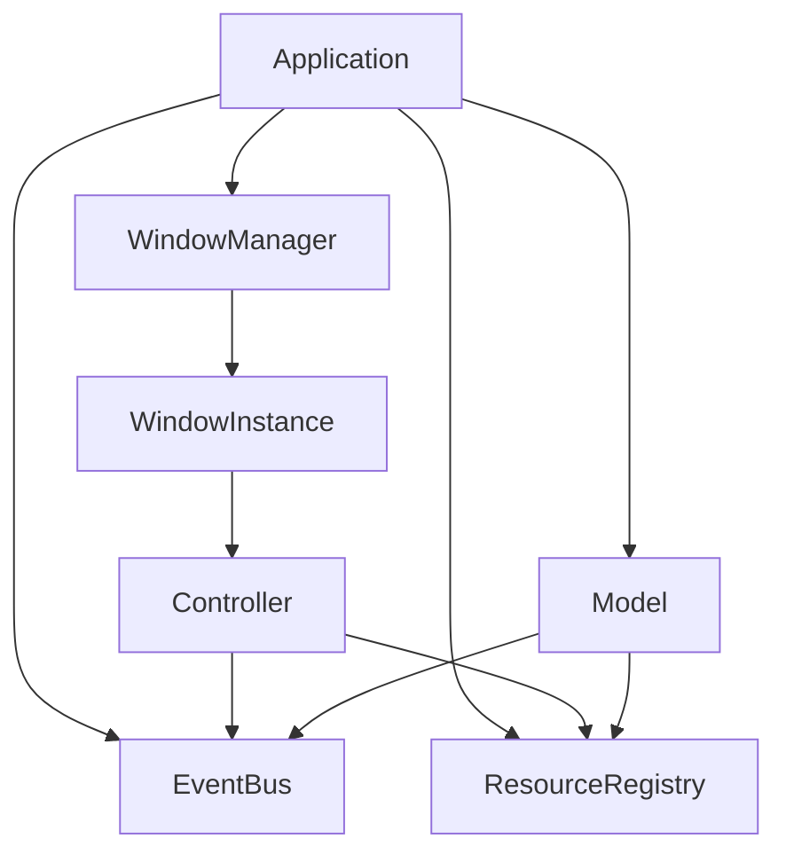
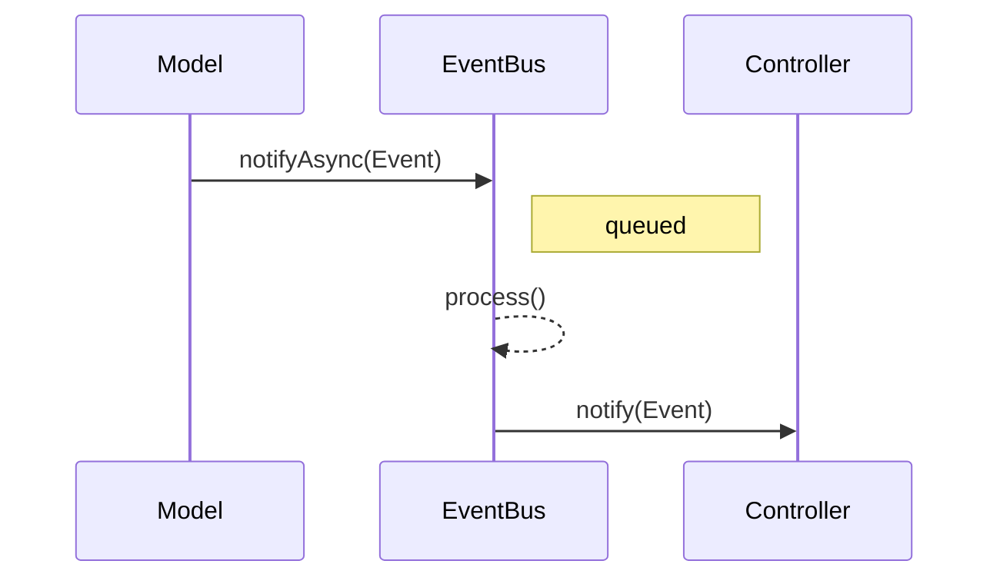
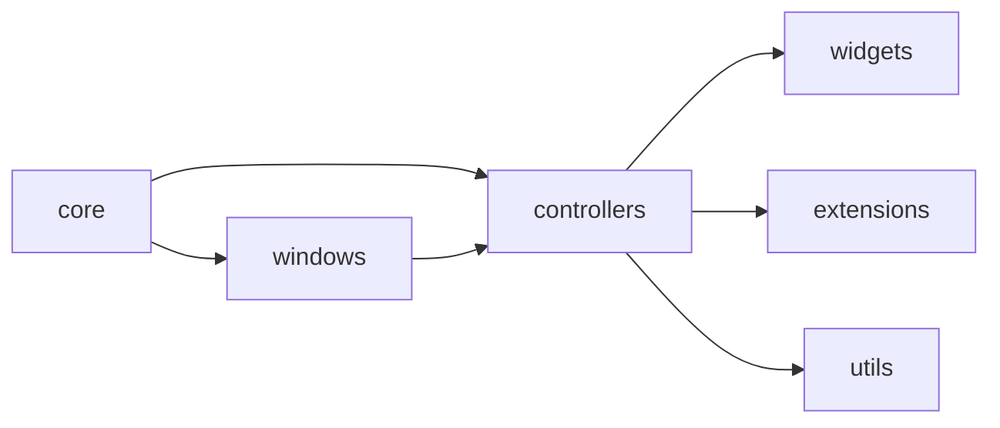

# AGENTS.md

* [1. Mission & Scope](#1-mission--scope)
* [2. System Map (Mermaid)](#2-system-map-mermaid)
* [3. Architectural Patterns & Invariants](#3-architectural-patterns--invariants)
* [4. Data & Contracts](#4-data--contracts)
* [5. Concurrency & Reliability](#5-concurrency--reliability)
* [6. Testing Strategy & Oracles](#6-testing-strategy--oracles)
* [7. Observability & Perf](#7-observability--perf)
* [8. Security & Secrets](#8-security--secrets)
* [9. Migration & Versioning](#9-migration--versioning)
* [10. Agent Playbooks (Recipes)](#10-agent-playbooks-recipes)
* [11. Anti-Patterns & Pitfalls](#11-anti-patterns--pitfalls)
* [12. Code Style: Git Commit Convention](#12-code-style-git-commit-convention)
* [13. Naming & Documentation Conventions](#13-naming--documentation-conventions)
* [14. Reference Index](#14-reference-index)
* [15. Branching & Release Policy](#15-branching--release-policy)
* [16. Documentation / Doxygen Style Guide](#16-documentation--doxygen-style-guide)
* [17. C++ Code Formatting](#17-c-code-formatting)
* [18. C++ Naming Conventions](#18-c-naming-conventions)
* [19. C++ Code Recommendations](#19-c-code-recommendations)

## 1. Mission & Scope

* Purpose: reference for developers and AI agents working on ImGuiX.
* Use during onboarding, code review, design discussions, and task planning.
* Core modules:

  * `include/imguix/core` – application, windows, events, resources.
  * `include/imguix/controllers` – controller hierarchy.
  * `include/imguix/widgets`, `extensions`, `utils` – reusable components.

## 2. System Map (Mermaid)

### Components



### Event Flow



### Module Overview



## 3. Architectural Patterns & Invariants

* **MVC-like**: `Application` owns `WindowManager`, `Model` and `Controller` renderers

  * Controllers handle both logic and view per frame.
* **Pub/Sub Event Bus**: `EventBus` with async queue and listener registry

  * Invariant: `process()` must be called on the main thread before frame render.
* **Mediator**: `EventMediator` wraps subscriptions and notifications; all controllers/models inherit it.
* **Strategy + Composite**: `StrategicController` selects strategy controllers; `ExtendedController` manages child controllers
* **Resource Registry**: singleton-like registry providing thread-safe resource access

  * Invariant: only one instance per type; access during registration throws.
* **Event Contract**: every event derives from `Pubsub::Event` and implements `type()` and `name()`
* **Model Restrictions**: synchronous `notify` functions are deleted to avoid race conditions; use `notifyAsync` only

### UI Sizing & Combo Patterns

**Sizing helpers** (`include/imguix/extensions/sizing.hpp`):
- `CalcTimeComboWidth()`, `CalcDateComboWidth()`, `CalcWeekdayComboWidth()`
- `CalcHMSFieldWidth()`, `CalcYearFieldWidth()`
- `CalcComboPreviewTextMax(float combo_w, ImGuiComboFlags flags=0, float slack=1.0f)`
- `CalcFieldWidthForSample(const char* sample_utf8)`

**Combo invariants:**
1) Set sizes before `BeginCombo(...)`:
   - `ImGui::SetNextItemWidth(combo_w);`
   - `ImGui::SetNextWindowSizeConstraints(min, max);` — clamp popup height.
2) Inside the popup when there's **no** frame/child:
   - left: `ImGui::Indent(style.FramePadding.x);`
   - right: `ImGui::SameLine(0,0); ImGui::Dummy(ImVec2(style.FramePadding.x, 0));`
   - then `ImGui::Unindent(style.FramePadding.x);`
3) Keep popup open for multi‑select grids:
   - `ImGui::Selectable(..., /*selected*/, ImGuiSelectableFlags_DontClosePopups, cell_size);`
4) Truncate preview text by pixels:
   - `max_text_px = CalcComboPreviewTextMax(combo_w, flags);`
   - accumulate tokens while `ImGui::CalcTextSize(...) <= max_text_px`, then append `"..."`
5) **Do not** hardcode width via `GetWindowWidth()*k` — use helpers/`CalcItemWidth()`.

**MWE: DaysOfWeekSelector (fragment)**

```cpp
const float combo_w = cfg.combo_width > 0 ? cfg.combo_width
                                          : ImGuiX::Extensions::CalcWeekdayComboWidth();
ImGui::SetNextItemWidth(combo_w);
ImGui::SetNextWindowSizeConstraints(ImVec2(0,0),
    ImVec2(FLT_MAX, ImGui::GetTextLineHeightWithSpacing()*12));

if (ImGui::BeginCombo(cfg.label ? cfg.label : u8"Days", preview.c_str(),
                      ImGuiComboFlags_HeightLargest | ImGuiComboFlags_PopupAlignLeft)) {
    const ImGuiStyle& st = ImGui::GetStyle();
    ImGui::Indent(st.FramePadding.x);

    // toolbar ...
    // grid ...
    if (ImGui::Selectable(token, selected,
                          ImGuiSelectableFlags_DontClosePopups, cell_sz)) {
        selected = !selected;
    }

    ImGui::SameLine(0,0); ImGui::Dummy(ImVec2(st.FramePadding.x, 0));
    ImGui::Unindent(st.FramePadding.x);
    ImGui::EndCombo();
}
```

## 4. Data & Contracts

* Event types are C++ structs; no implicit serialization.
* Identifiers:

  * Windows: auto-incremented IDs inside `Application`
* Time: use steady clocks for internal timing (see tests).
* Table of invariants:

| Contract                             | Where            | Check/Assert                      | Violation Consequence                              |
| ------------------------------------ | ---------------- | --------------------------------- | -------------------------------------------------- |
| Event implements `type()` & `name()` | All events       | Compile-time review               | Runtime type info missing; listeners break         |
| `process()` called each frame        | Main loop        | Manual call after `notifyAsync`   | Events stay queued, logic stalls                   |
| Resource registered once             | ResourceRegistry | `registerResource` returns bool   | Duplicate wastes memory or causes unexpected state |
| Model uses `notifyAsync` only        | Model            | Compilation fails for sync notify | Thread-safety compromised                          |

**FontManager semantics (manual mode)**

| Contract                                   | Where        | Check/Assert                     | Violation Consequence                        |
| ------------------------------------------ | ------------ | -------------------------------- | -------------------------------------------- |
| Ranges preset vs explicit: last call wins  | FontManager  | Code review / unit test          | Missing glyphs when preset is overridden     |
| PUA required for icon fonts                | FontManager  | Visual check / glyph presence    | Icons render as tofu (□) without PUA ranges  |
| **Preset tokens include MiscSymbols/Dingbats/Arrows** | FontManager | Docs + unit test for glyphs      | Symbols (⚠, ✈, ←…) miss without ranges       |
| **Glyph fallback for markers**: U+26A0 → U+E002 → "(!)" | Widgets/Fonts | Unit test: FindGlyph chain       | Empty icon if neither Unicode nor PUA exists |

## 5. Concurrency & Reliability

* EventBus uses mutexes for queue and subscription maps

  * Lock order: queue mutex before subscriptions.
  * Backpressure: event queue processed every frame; ensure `process()` is called.
* ResourceRegistry uses `shared_mutex` (or `mutex` on Emscripten) to protect maps
* Models may spawn threads but must signal shutdown via `isClosing()`.
* Retry/timeout: not implemented; recommend adding for IO.
* Error taxonomy: use `std::runtime_error` for missing resources; extend with custom exceptions as needed.
* Reliability checklist:

  * [ ] All event subscriptions unsubscribed in destructors.
  * [ ] `process()` invoked per frame.
  * [ ] Resources registered before access.
  * [ ] Threads join on shutdown.

## 6. Testing Strategy & Oracles

* **Unit tests**: event system, resource registry, application loop (`tests/*`).
* **Property tests**: recommended for EventBus ordering and resource uniqueness.
* **Integration**: build `tests/test-core-application.cpp` for backend-specific flows.
* Oracles: event receipt, resource retrieval, frame rendering.
* Fixtures: use minimal controllers/models with deterministic behaviour.
* When adding a module, test table:
* Font atlas metrics: log atlas texture size and glyph count after `fontsBuildNow`.
* Budget: keep atlas ≤ 4–8 MB; revisit if adding full CJK + symbols simultaneously.

| Aspect     | Mandatory Test                          |
| ---------- | --------------------------------------- |
| Event      | subscribe/notify, async queue           |
| Resource   | register, duplicate register, retrieval |
| Controller | drawContent/drawUi called               |
| Model      | thread shutdown, registry access        |

## 7. Observability & Perf

* Logging: use `stdout`/`stderr`; avoid PII.
* Metrics: instrument event queue length and frame time.
* Latency budget: target <16 ms per frame (60 FPS).
* Allocation norms: avoid per-frame heap allocations in hot paths.
* Pre-merge checklist:

  * [ ] Run debug build with sanitizers when possible.
  * [ ] Profile frame time if new rendering logic added.
  * [ ] Ensure logs have correlation IDs for threaded models.

## 8. Security & Secrets

* No secrets should be committed; configs live under `data/config`.
* Never log tokens or file paths containing credentials.
* External HTTP/WebSocket not present; when added, enforce TLS and validate payloads.

## 9. Migration & Versioning

* Maintain backward compatibility of events and DTOs; introduce new classes instead of mutating existing ones.
* Resource schema changes require migration functions in registry.
* Deprecation: mark APIs in headers with `[[deprecated]]` and provide grace period through changelog.

## 10. Agent Playbooks (Recipes)

### Add a new module/aggregate/service

1. Place headers under `include/imguix/<domain>`.
2. Derive from `Model` or `Controller` as appropriate.
3. Register in `Application` via `createModel`/`createWindow`.
4. Add unit tests verifying subscriptions, drawing and resource access.

### Add a new event/DTO type

1. Derive from `Pubsub::Event` and implement `type()`/`name()`.
2. Define payload fields.
3. Subscribe via `EventMediator::subscribe`.
4. Test: emit via `notifyAsync`, ensure `process()` routes it.
5. Log occurrence and add metrics counter.

### Integrate a new back-end/adapter

1. Implement `WindowInstance` for backend; place `.ipp` next to others.
2. Provide `create`, `handleEvents`, `drawContent`, `drawUi`, `present`.
3. Add backend-specific build scripts and tests.
4. Run contract tests to ensure window controls (size, visibility, active state) work.

### PR & ADR templates

* **PR**: "feat(scope): summary" + motivation, test output.
* **ADR**: Context → Decision → Consequences. Store in `/docs/adr/` (create if absent).

## 11. Anti-Patterns & Pitfalls

| Symptom                   | Cause                                            | Fix                                                                              |
| ------------------------- | ------------------------------------------------ | -------------------------------------------------------------------------------- |
| Events never handled      | `process()` not called                           | Process queue each frame                                                         |
| Resource retrieval throws | `registerResource` missing or still initializing | Register before access and handle `tryGetResource`                               |
| Dangling subscriptions    | Forgetting `unsubscribeAll`                      | Ensure controllers/models inherit `EventMediator` which handles destructor unsub |
| Blocked shutdown          | Threaded model not checking `isClosing()`        | Poll flag and join threads in destructor                                         |
| Text shows as squares     | Ranges include only PUA (icons)                  | Use `fontsSetRangesPreset("Default+...+PUA")` or add non-PUA ranges explicitly   |
| Icons missing             | PUA not included in ranges                       | Add `PUA` token to preset or explicit pair `0xE000–0xF8FF`                       |
| PopStyleColor / PopID mismatch | PushStyleColor/PushID/PushVar called asymmetrically | Always use a flag pattern: `bool pushed = false; if (cond) { ImGui::PushStyleColor(...); pushed = true; } ... if (pushed) ImGui::PopStyleColor();` |
| Misc symbols not rendered | Missing `MiscSymbols`/`Dingbats`/`Arrows` ranges | Add these presets or merge a symbol font (e.g., Noto Sans Symbols)               |
| Atlas bloat               | Too many ranges/fonts merged                     | Audit ranges; split icon font; check atlas size in logs/metrics                  |
| Preview clipped or shaking  | Real `text_max_px` not accounted for | Compute via `CalcComboPreviewTextMax(combo_w, flags)` and fill with `CalcTextSize` |
| Content sticks to popup edges | No inner padding | Inside popup: `Indent(style.FramePadding.x)` on the left and `SameLine(0,0); Dummy({style.FramePadding.x,0})` on the right; then `Unindent` |
| Popup closes when clicking a cell | `Selectable` missing flag | Use `ImGuiSelectableFlags_DontClosePopups` for multi-select |
| Hardcoded width factors | `GetWindowWidth()*k` | Use `SetNextItemWidth(Calc*ComboWidth)`/`CalcItemWidth()` |

Quick grep patterns:

* `rg notifyAsync` to audit asynchronous event usage.
* `rg registerResource` to verify unique registrations.

## 12. Code Style: Git Commit Convention

Follow the [Conventional Commits](https://www.conventionalcommits.org/) style:

* `feat:` new features
* `fix:` bug fixes
* `docs:` documentation changes
* `refactor:` code refactoring without behaviour changes
* `test:` when adding or modifying tests

Format: `type(scope): short description` where the scope is optional. Keep messages short and imperative.

## 13. Naming & Documentation Conventions

### Variable Naming

* Use `snake_case` for variables and parameters.
* Private members must use the `m_` prefix (e.g., `m_event_hub`, `m_task_manager`). Public variables may omit the prefix.
* Optional prefixes `p_` and `str_` when a function or method handles more than five variables or arguments of different types.
* Boolean variables start with `is`, `has`, `use`, `enable` or `m_is_`, `m_has_`, etc., for fields.
* Do not use prefixes `b_`, `n_`, or `f_`.

### Doxygen Comments

* Write all code and Doxygen comments in English.
* Use `/// \brief` before functions and classes.
* Avoid starting descriptions with "The".

### File Names

* Single-class files use `PascalCase` (e.g., `TradeManager.hpp`).
* Multi-class or utility files use `snake_case` (e.g., `trade_utils.hpp`).

### Entity Names

* Names of classes, structs, and enums use `PascalCase`.
* Method names use `camelCase`.

### Method Names

* Methods are written in `camelCase`.
* Getter methods may drop the `get_` prefix when returning existing references or values, exposing internal objects, or acting like a property (e.g., `size()`, `empty()`).
* Keep the `get_` prefix when a method performs computation or when omission could mislead.

## 14. Reference Index

### Key Directories

| Path                         | Role                                                    |
| ---------------------------- | ------------------------------------------------------- |
| `include/imguix/core`        | Core application, window, event, resource modules       |
| `include/imguix/controllers` | Controller hierarchy (Application, Strategic, Extended) |
| `include/imguix/widgets`     | Reusable UI widgets                                     |
| `include/imguix/extensions`  | Utility helpers for ImGui                               |
| `tests`                      | Example programs and basic tests                        |

### Key Documents

| Path                     | Role                                                   |
| ------------------------ | ------------------------------------------------------ |
| `docs/FONTS-GUIDE.md` | FontManager usage; preset tokens including `MiscSymbols`, `Dingbats`, `Arrows`, `PUA` |

### Dependency Map

| Module         | Depends On                                        |
| -------------- | ------------------------------------------------- |
| Application    | WindowManager, EventBus, ResourceRegistry, Models |
| WindowInstance | ApplicationContext, EventBus, Controllers         |
| Controller     | WindowInterface, EventBus, ResourceRegistry       |
| Model          | ApplicationContext, EventBus, ResourceRegistry    |

### Glossary

* **EventBus** – publish/subscribe hub for events.
* **Model** – non-visual component processed each frame.
* **Controller** – window-bound renderer and logic unit.
* **ResourceRegistry** – thread-safe store for shared resources.
* **WindowInstance** – backend-specific window implementation.

## 15. Branching & Release Policy

**Default workflow**

* Active development happens in **`main`**.
* **`stable`** contains only tested, releasable code.
* Default branch for cloning/pushing: **`main`**.

**Rules**

* Do **not** commit directly to `stable`.
* Merge to `stable` only via PR from `main` (or hotfix branches), with CI green and at least 1 code review.
* Tag releases on `stable` as `vX.Y.Z` after merge.
* Hotfixes: create `hotfix/*` from `stable`, PR back into `stable`, then **cherry-pick** or **merge** into `main`.

**Branch protection (required)**

* Protect `stable`: no direct pushes, require PR review, require passing CI, require up-to-date with base before merge.
* (Optional) Protect `main`: require CI.

**CI/CD**

* CI runs on `main` and `stable`.
* Release artifacts (SDK, binaries, images) publish **only** on `stable` (tags or merges into `stable`).

**Local setup (recommended)**

```bash
# track both branches
git fetch origin
git checkout -B main   origin/main
git checkout -B stable origin/stable

# set default push to current branch name
git config push.default current
```

**Release flow**

1. Work & merge into `main`.
2. Create a PR `main → stable`, ensure CI passes.
3. Merge; tag the commit:

   ```bash
   git checkout stable
   git pull
   git tag -a vX.Y.Z -m "Release vX.Y.Z"
   git push --tags
   ```
4. CI on `stable` publishes release artifacts.

**Do/Don’t**

* ✅ `feature/*` → PR into `main`.
* ✅ `hotfix/*` from `stable` → PR into `stable` → sync back to `main`.
* ❌ No force-push to `stable`.
* ❌ No direct commits to `stable`.

---

## Build Architecture

This project’s CMake is designed around a **three‑mode dependency policy** and **target‑only linking**, with optional SDK bundling and test apps. The goals are: easy vendorless consumption, reproducible bundled builds, and clean integration as a subproject.

### 1) Three‑Mode Dependency Policy

Each dependency supports a mode: `AUTO | SYSTEM | BUNDLED`. There is a global switch `IMGUIX_DEPS_MODE` and per‑dependency overrides (e.g. `IMGUIX_DEPS_FMT_MODE`, `IMGUIX_DEPS_MDBX_MODE`, …).
Resolution order in `AUTO` (or when a per‑dep mode inherits the global setting):

1. **SYSTEM/CONFIG**: `find_package(... CONFIG QUIET)`; if a suitable imported target exists, use it.
2. **Submodule**: if sources are present (e.g. `libs/<dep>`), `add_subdirectory(...)` and reuse the provided targets.
3. **FetchContent**: fallback to fetch the dependency and expose its targets.
   If `SYSTEM` is explicitly requested and the package cannot be found, configuration fails fast.

### 2) Target‑Only Linking

We never export raw include/library paths. Everything links via targets:

* Examples: `fmt::fmt`, `mdbx::mdbx`, `ImGui-SFML`, `SFML::Graphics`/`SFML::Window`/`SFML::System`, `nlohmann_json::nlohmann_json`, `imgui::imgui`.
* If a dependency’s headers/types are visible in our public interface, link it as `PUBLIC`; otherwise `PRIVATE`.
* For nonstandard packages (e.g., libmdbx) we normalize to an alias like `mdbx::mdbx` (if upstream target names vary).

### 3) Backends and Feature Flags

* Backend options: `IMGUIX_USE_SFML_BACKEND` (default ON), `IMGUIX_USE_GLFW_BACKEND` (OFF), `IMGUIX_USE_SDL2_BACKEND` (OFF). Exactly one is expected.
* Core ImGui and extras:

  * `IMGUIX_IMGUI_FREETYPE` enables `imgui_freetype` integration (links FreeType and defines `IMGUI_ENABLE_FREETYPE`).
  * `IMGUIX_IMGUI_STDLIB` controls `misc/cpp/imgui_stdlib.cpp`. Default **ON** for non‑SFML backends, forced **OFF** for SFML (ImGui‑SFML already builds it to avoid duplicate symbols).

### 4) Library Form: Header‑Only vs Compiled

* `IMGUIX_HEADER_ONLY` toggles a pure interface target vs a compiled library (`STATIC` by default; `IMGUIX_BUILD_SHARED` switches to `SHARED`).
* In header‑only mode we avoid linking transitives; consumers bring their own backend/ImGui/FreeType via targets.

### 5) Tests

* `IMGUIX_BUILD_TESTS` builds executables in `tests/` and registers them with CTest.
* Test executables link to the selected backend + ImGui targets and copy runtime assets via helper functions.

### 6) Assets & App Icon Helpers

* `imguix_add_assets(<target> DIRS <paths> [DEST_RUNTIME <rel>] [EXCLUDE_DIRS <names...>])` copies asset directories next to the built binary (post‑build). Use `EXCLUDE_DIRS web` to skip `assets/data/web` for native tests.
* `imguix_copy_and_embed_app_icon(<target>)` (Windows) adds `app_icon.rc` to sources and copies `icon.png` to the runtime `data/resources/icons` folder.

### 7) SDK Bundling

* `IMGUIX_SDK_INSTALL` enables installing an SDK layout (headers, libs, CMake package exports, and optionally quickstart).
* `IMGUIX_SDK_BUNDLE_DEPS` controls whether third‑party dependencies are also staged into the SDK (`include/`, `lib/`, and their `cmake/` packages when available).
* Dear ImGui: only headers are installed (pruned of `.git`, `backends`, `docs`, etc.). Optionally “flatten” selected headers into the SDK include root via `IMGUIX_SDK_FLATTEN_MISC_HEADERS` (e.g., `imgui_stdlib.h`, `imgui_freetype.h`).
* ImGui‑SFML / fmt / libmdbx / FreeType / SFML: installed via their own `install(...)` rules when available (we flip upstream install switches like `FMT_INSTALL=ON`, `MDBX_INSTALL_STATIC=ON`), otherwise we manually install target artifacts and headers.
* Quickstart template: `IMGUIX_SDK_INSTALL_QUICKSTART` installs a ready‑to‑build sample (`quickstart/`) and optional resources (`quickstart/data/resources`).

### 8) Consuming as a Subproject (Superbuild Case)

A parent project can bring its own dependencies; our CMake will detect existing targets and reuse them without duplication:

```cmake
# Top-level CMake
find_package(fmt CONFIG REQUIRED)            # or add_subdirectory(fmt)
# For MDBX: either find_package(MDBX ...) or add_subdirectory(libmdbx) and create an alias mdbx::mdbx

# Force our subproject to use system deps only:
set(IMGUIX_DEPS_MODE SYSTEM CACHE STRING "" FORCE)

add_subdirectory(external/imguix)
target_link_libraries(my_app PRIVATE ImGuiX::imguix)
```

### 9) Exported Package

* We export `ImGuiXTargets.cmake` and `ImGuiXConfig.cmake` so that consumers can `find_package(ImGuiX CONFIG REQUIRED)` and use `ImGuiX::imguix`.
* When SDK is installed, the package files land under `lib/cmake/ImGuiX` within the SDK root.

### 10) Typical Invocations

Build tests + bundle SDK:

```bash
cmake -S . -B build -DCMAKE_BUILD_TYPE=Release ^
  -DIMGUIX_BUILD_TESTS=ON -DIMGUIX_SDK_INSTALL=ON -DIMGUIX_SDK_BUNDLE_DEPS=ON
cmake --build build --target install --config Release
```

Build SDK only (no tests):

```bash
cmake -S . -B build -DCMAKE_BUILD_TYPE=Release ^
  -DIMGUIX_BUILD_TESTS=OFF -DIMGUIX_SDK_INSTALL=ON -DIMGUIX_SDK_BUNDLE_DEPS=ON
cmake --build build --target install --config Release
```

Use system dependencies only:

```bash
cmake -S . -B build -DIMGUIX_DEPS_MODE=SYSTEM
```

Disable SFML backend and use pure Dear ImGui with std::string helpers:

```bash
cmake -S . -B build -DIMGUIX_USE_SFML_BACKEND=OFF -DIMGUIX_IMGUI_STDLIB=ON
```

## 16. Documentation / Doxygen Style Guide

### Scope
Applies to all C++17 and newer code in this repository.

### Fence & Tag Conventions
* Use `///` for all Doxygen comments; avoid `/** ... */` blocks.
* Use backslash tags (`\brief`, `\param`, etc.).
* Write comments in English.

### Tag Ordering
Document entities using the following sequence:
1. `\brief` – one short sentence (≤100 chars).
2. `\tparam` – one per template parameter.
3. `\param` – in function signature order.
4. `\return` – exactly once for non-void functions.
5. `\throws` – per exception type.
6. `\pre` / `\post`.
7. `\invariant`.
8. `\complexity`.
9. `\thread_safety`.
10. `\note` / `\warning` (optional).

All function parameters, template parameters, and non-void return values must be documented. Omit `\return` for void functions.

### Additional Guidance
* Keep wording concise, imperative, and under ~100–120 columns. Avoid leading “The”.
* Public headers document behavior and usage but omit internal layout details.
* Include fenced C++ examples for key public APIs when helpful.

### Examples

```cpp
/// \brief Resize canvas to the target dimensions.
/// \param w Width in pixels.
/// \param h Height in pixels.
/// \pre w >= 0 && h >= 0.
/// \post New size equals (w, h).
void resize(int w, int h);

/// \brief Computes 64-bit hash of the input.
/// \tparam T Input type supporting contiguous byte access.
/// \param data Input value.
/// \return 64-bit hash.
/// \complexity O(n) over input size.
/// \thread_safety Not thread-safe.
template<class T>
uint64_t hash(const T& data);
```

### Compliance
If future style conflicts arise, this section takes precedence over legacy comments.

## 17. C++ Code Formatting

### Indentation & Whitespace
* Use 4 spaces; never use tabs.
* Indent all code within a `namespace` by one level.
* Soft line limit of 120 characters.

### Braces
* K&R style – opening brace on the same line.

### Function Signatures (many parameters)
* If a function signature exceeds the line limit, break after `(`.
* Place each parameter on its own line with double indentation (8 spaces).
* Align the closing `) {` with a single indentation (4 spaces).

### Class Declarations — Multiple Inheritance
* Keep `:` on the line with the class name.
* List each base class on a new line with double indentation (8 spaces) and trailing commas except the last.
* `{` remains on the same line as the last base class.

```cpp
namespace ImGuiX {

    class FontManager :
        private FontManagerViewCRTP<FontManager>,
        private FontManagerControlCRTP<FontManager> {
    public:
        // ...
    };

} // namespace ImGuiX
```

### Function Calls — Many Arguments & Ternary
* Break after `(` and put each argument on its own line with double indentation (8 spaces).
* If an argument uses a ternary `?:`, break after `?` and before `:`; align both outcomes under the start of the ternary using the same double indentation.
* Place the final `)` on its own line aligned with the call line, then `);`.

**Good:**
```cpp
return ImGui::GetIO().Fonts->AddFontFromFileTTF(
        resolved.c_str(),
        eff_px,
        &cfg,
        ranges.empty() ?
            nullptr :
            ranges.data()
);
```

**Bad (closing paren indented like arguments):**
```cpp
return ImGui::GetIO().Fonts->AddFontFromFileTTF(
        resolved.c_str(),
        eff_px,
        &cfg,
        ranges.empty() ?
            nullptr :
            ranges.data()
    );
```

### Pointer/Reference Style
* Bind the symbol to the type: `ImFont*`, `const Foo&`.

### Doxygen
* Use `///` comments in English with concise `@brief`, `@param`, `@return`, and `@note` tags.

### Includes
* Order includes as: header of the current file, then standard library headers `<...>`, then external or project headers `"..."`.
* Separate these groups with a blank line.

## 18. C++ Naming Conventions

* Namespaces and types: PascalCase.
* Methods and member functions: camelCase.
* Variables and parameters: snake_case.
  * Private members prefixed with `m_`.
  * Booleans start with `is`, `has`, `use`, or `enable`; private booleans use `m_is_`, `m_has_`, etc.
* Constants: `kPascalCase` or `UPPER_CASE` (prefer `kPascalCase` for `constexpr`).
* Events: PascalCase with the `Event` suffix.
* Header guards follow `_PROJECT_MODULE_FILENAME_HPP_INCLUDED`.

## 19. C++ Code Recommendations

* Prefer early-return to reduce nesting.
* Keep functions short and cohesive.
* Avoid hidden global state; favor explicit dependencies.
* Use `enum class` for scoped enums.
* Avoid macros in public APIs unless required for portability.
