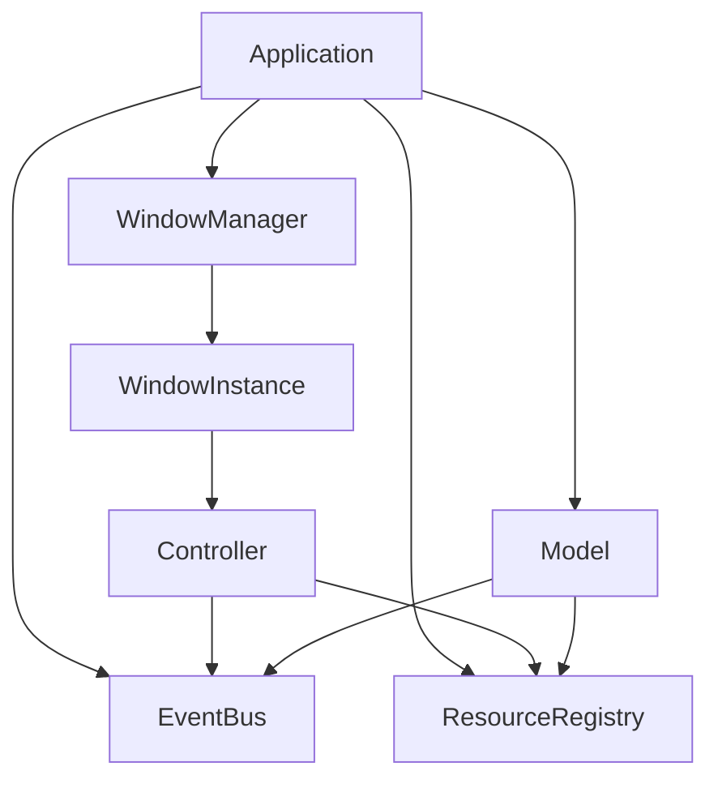
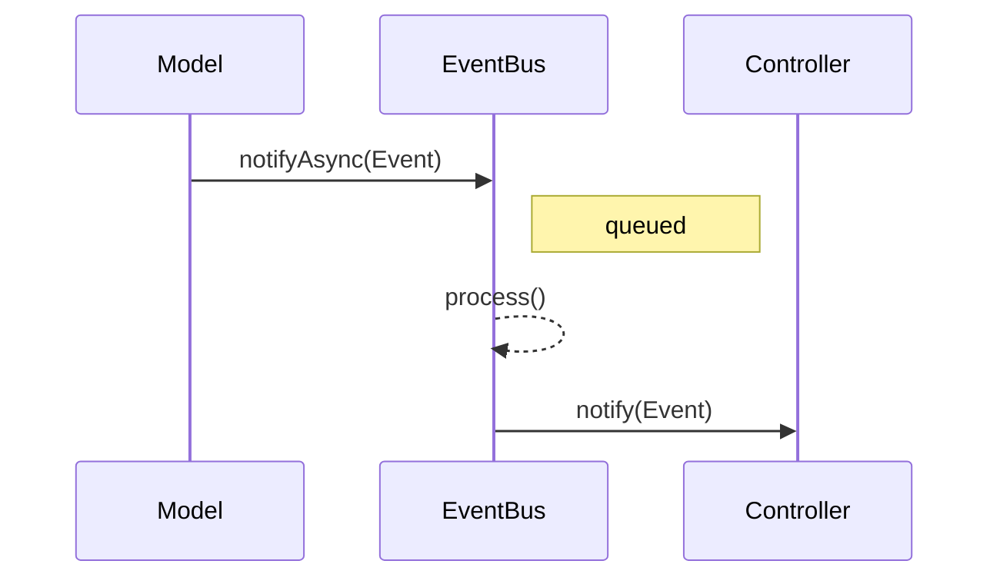
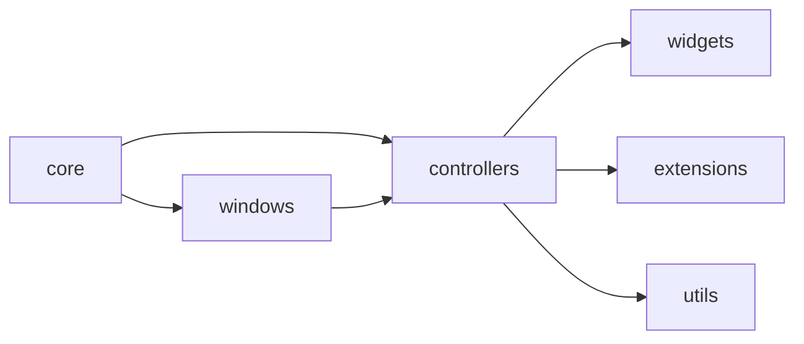

# AGENTS.md

- [1. Mission & Scope](#1-mission--scope)
- [2. System Map (Mermaid)](#2-system-map-mermaid)
- [3. Architectural Patterns & Invariants](#3-architectural-patterns--invariants)
- [4. Data & Contracts](#4-data--contracts)
- [5. Concurrency & Reliability](#5-concurrency--reliability)
- [6. Testing Strategy & Oracles](#6-testing-strategy--oracles)
- [7. Observability & Perf](#7-observability--perf)
- [8. Security & Secrets](#8-security--secrets)
- [9. Migration & Versioning](#9-migration--versioning)
- [10. Agent Playbooks (Recipes)](#10-agent-playbooks-recipes)
- [11. Anti-Patterns & Pitfalls](#11-anti-patterns--pitfalls)
- [12. Code Style: Git Commit Convention](#12-code-style-git-commit-convention)
- [13. Naming & Documentation Conventions](#13-naming--documentation-conventions)
- [14. Reference Index](#14-reference-index)

## 1. Mission & Scope
- Purpose: reference for developers and AI agents working on ImGuiX.
- Use during onboarding, code review, design discussions, and task planning.
- Core modules:
  - `include/imguix/core` – application, windows, events, resources.
  - `include/imguix/controllers` – controller hierarchy.
  - `include/imguix/widgets`, `extensions`, `utils` – reusable components.

## 2. System Map (Mermaid)
### Components

### Event Flow

### Module Overview

## 3. Architectural Patterns & Invariants
- **MVC-like**: `Application` owns `WindowManager`, `Model` and `Controller` renderers【F:include/imguix/core/application/Application.hpp†L21-L24】【F:include/imguix/core/window/WindowInstance.hpp†L27-L32】
  - Controllers handle both logic and view per frame.
- **Pub/Sub Event Bus**: `EventBus` with async queue and listener registry【F:include/imguix/core/pubsub/EventBus.hpp†L24-L69】
  - Invariant: `process()` must be called on the main thread before frame render.
- **Mediator**: `EventMediator` wraps subscriptions and notifications; all controllers/models inherit it.
- **Strategy + Composite**: `StrategicController` selects strategy controllers; `ExtendedController` manages child controllers【F:include/imguix/controllers/StrategicController.hpp†L23-L36】【F:include/imguix/controllers/ExtendedController.hpp†L22-L57】
- **Resource Registry**: singleton-like registry providing thread-safe resource access【F:include/imguix/core/resource/ResourceRegistry.hpp†L23-L68】
  - Invariant: only one instance per type; access during registration throws.
- **Event Contract**: every event derives from `Pubsub::Event` and implements `type()` and `name()`【F:include/imguix/core/pubsub/Event.hpp†L20-L29】
- **Model Restrictions**: synchronous `notify` functions are deleted to avoid race conditions; use `notifyAsync` only【F:include/imguix/core/model/Model.hpp†L58-L63】

## 4. Data & Contracts
- Event types are C++ structs; no implicit serialization.
- Identifiers:
  - Windows: auto-incremented IDs inside `Application`【F:include/imguix/core/application/Application.hpp†L83-L84】
- Time: use steady clocks for internal timing (see tests).
- Table of invariants:

| Contract | Where | Check/Assert | Violation Consequence |
|---|---|---|---|
|Event implements `type()` & `name()`|All events|Compile-time review|Runtime type info missing; listeners break|
|`process()` called each frame|Main loop|Manual call after `notifyAsync`|Events stay queued, logic stalls|
|Resource registered once|ResourceRegistry|`registerResource` returns bool|Duplicate wastes memory or causes unexpected state|
|Model uses `notifyAsync` only|Model|Compilation fails for sync notify|Thread-safety compromised|

## 5. Concurrency & Reliability
- EventBus uses mutexes for queue and subscription maps【F:include/imguix/core/pubsub/EventBus.hpp†L71-L77】
  - Lock order: queue mutex before subscriptions.
  - Backpressure: event queue processed every frame; ensure `process()` is called.
- ResourceRegistry uses `shared_mutex` (or `mutex` on Emscripten) to protect maps【F:include/imguix/core/resource/ResourceRegistry.hpp†L69-L75】
- Models may spawn threads but must signal shutdown via `isClosing()`.
- Retry/timeout: not implemented; recommend adding for IO.
- Error taxonomy: use `std::runtime_error` for missing resources; extend with custom exceptions as needed.
- Reliability checklist:
  - [ ] All event subscriptions unsubscribed in destructors.
  - [ ] `process()` invoked per frame.
  - [ ] Resources registered before access.
  - [ ] Threads join on shutdown.

## 6. Testing Strategy & Oracles
- **Unit tests**: event system, resource registry, application loop (`tests/*`).
- **Property tests**: recommended for EventBus ordering and resource uniqueness.
- **Integration**: build `tests/test-core-application.cpp` for backend-specific flows.
- Oracles: event receipt, resource retrieval, frame rendering.
- Fixtures: use minimal controllers/models with deterministic behaviour.
- When adding a module, test table:

| Aspect | Mandatory Test |
|---|---|
|Event|subscribe/notify, async queue|
|Resource|register, duplicate register, retrieval|
|Controller|drawContent/drawUi called|
|Model|thread shutdown, registry access|

## 7. Observability & Perf
- Logging: use `stdout`/`stderr`; avoid PII.
- Metrics: instrument event queue length and frame time.
- Latency budget: target <16 ms per frame (60 FPS).
- Allocation norms: avoid per-frame heap allocations in hot paths.
- Pre-merge checklist:
  - [ ] Run debug build with sanitizers when possible.
  - [ ] Profile frame time if new rendering logic added.
  - [ ] Ensure logs have correlation IDs for threaded models.

## 8. Security & Secrets
- No secrets should be committed; configs live under `data/config`.
- Never log tokens or file paths containing credentials.
- External HTTP/WebSocket not present; when added, enforce TLS and validate payloads.

## 9. Migration & Versioning
- Maintain backward compatibility of events and DTOs; introduce new classes instead of mutating existing ones.
- Resource schema changes require migration functions in registry.
- Deprecation: mark APIs in headers with `[[deprecated]]` and provide grace period through changelog.

## 10. Agent Playbooks (Recipes)
### Add a new module/aggregate/service
1. Place headers under `include/imguix/<domain>`.
2. Derive from `Model` or `Controller` as appropriate.
3. Register in `Application` via `createModel`/`createWindow`.
4. Add unit tests verifying subscriptions, drawing and resource access.

### Add a new event/DTO type
1. Derive from `Pubsub::Event` and implement `type()`/`name()`.
2. Define payload fields.
3. Subscribe via `EventMediator::subscribe`.
4. Test: emit via `notifyAsync`, ensure `process()` routes it.
5. Log occurrence and add metrics counter.

### Integrate a new back-end/adapter
1. Implement `WindowInstance` for backend; place `.ipp` next to others.
2. Provide `create`, `handleEvents`, `drawContent`, `drawUi`, `present`.
3. Add backend-specific build scripts and tests.
4. Run contract tests to ensure window controls (size, visibility, active state) work.

### PR & ADR templates
- **PR**: "feat(scope): summary" + motivation, test output.
- **ADR**: Context → Decision → Consequences. Store in `/docs/adr/` (create if absent).

## 11. Anti-Patterns & Pitfalls
| Symptom | Cause | Fix |
|---|---|---|
|Events never handled|`process()` not called|Process queue each frame|
|Resource retrieval throws|`registerResource` missing or still initializing|Register before access and handle `tryGetResource`|
|Dangling subscriptions|Forgetting `unsubscribeAll`|Ensure controllers/models inherit `EventMediator` which handles destructor unsub|
|Blocked shutdown|Threaded model not checking `isClosing()`|Poll flag and join threads in destructor|

Quick grep patterns:
- `rg notifyAsync` to audit asynchronous event usage.
- `rg registerResource` to verify unique registrations.

## 12. Code Style: Git Commit Convention
Follow the [Conventional Commits](https://www.conventionalcommits.org/) style:

- `feat:` new features
- `fix:` bug fixes
- `docs:` documentation changes
- `refactor:` code refactoring without behaviour changes
- `test:` when adding or modifying tests

Format: `type(scope): short description` where the scope is optional. Keep messages short and imperative.

## 13. Naming & Documentation Conventions

### Variable Naming
- Prefix `m_` for all class fields (e.g., `m_event_hub`, `m_task_manager`).
- Optional prefixes `p_` and `str_` when a function or method handles more than five variables or arguments of different types.
- Boolean variables start with `is`, `has`, `use`, `enable` or `m_is_`, `m_has_`, etc., for fields.
- Do not use prefixes `b_`, `n_`, or `f_`.

### Doxygen Comments
- Write all code and Doxygen comments in English.
- Use `/// \brief` before functions and classes.
- Avoid starting descriptions with "The".

### File Names
- Single-class files use `CamelCase` (e.g., `TradeManager.hpp`).
- Multi-class or utility files use `snake_case` (e.g., `trade_utils.hpp`).

### Entity Names
- Names of classes, structs, and enums use `CamelCase`.
- Method names use `snake_case`.

### Method Names
- Methods are written in `snake_case`.
- Getter methods may drop the `get_` prefix when returning existing references or values, exposing internal objects, or acting like a property (e.g., `size()`, `empty()`).
- Keep the `get_` prefix when a method performs computation or when omission could mislead.

## 14. Reference Index
### Key Directories
| Path | Role |
|---|---|
|`include/imguix/core`|Core application, window, event, resource modules|
|`include/imguix/controllers`|Controller hierarchy (Application, Strategic, Extended)|
|`include/imguix/widgets`|Reusable UI widgets|
|`include/imguix/extensions`|Utility helpers for ImGui|
|`tests`|Example programs and basic tests|

### Dependency Map
| Module | Depends On |
|---|---|
|Application|WindowManager, EventBus, ResourceRegistry, Models|
|WindowInstance|ApplicationControl, EventBus, Controllers|
|Controller|WindowControl, EventBus, ResourceRegistry|
|Model|ApplicationControl, EventBus, ResourceRegistry|

### Glossary
- **EventBus** – publish/subscribe hub for events.
- **Model** – non-visual component processed each frame.
- **Controller** – window-bound renderer and logic unit.
- **ResourceRegistry** – thread-safe store for shared resources.
- **WindowInstance** – backend-specific window implementation.

