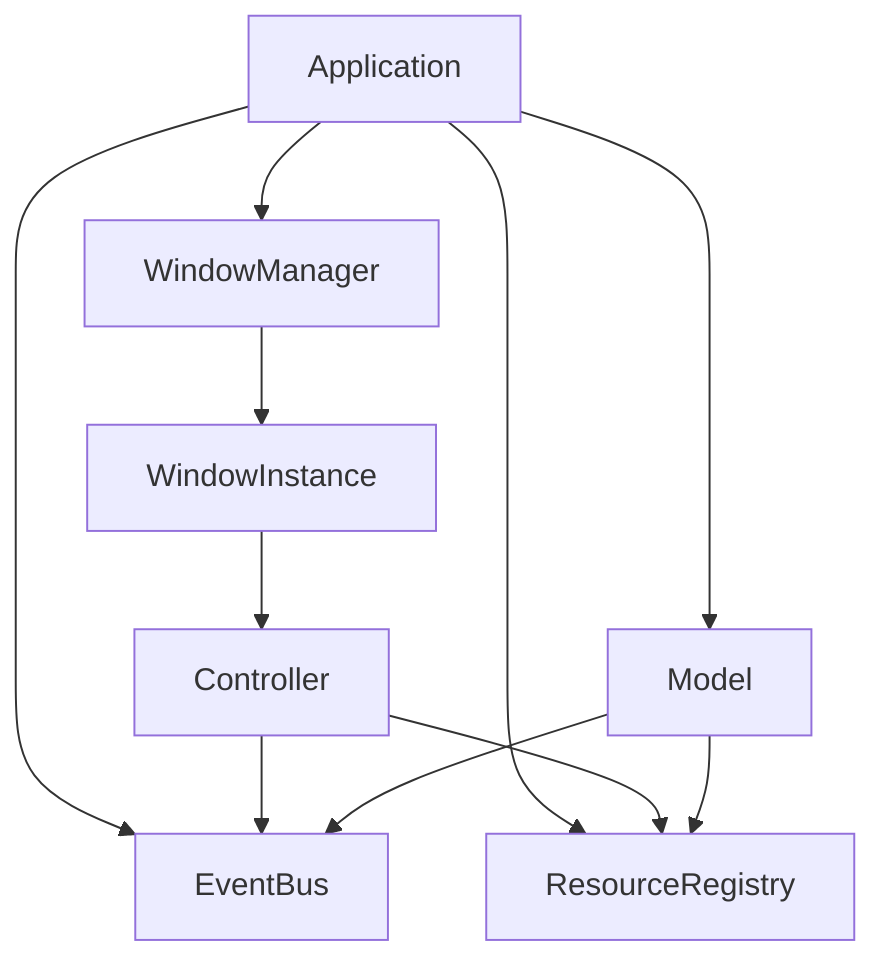
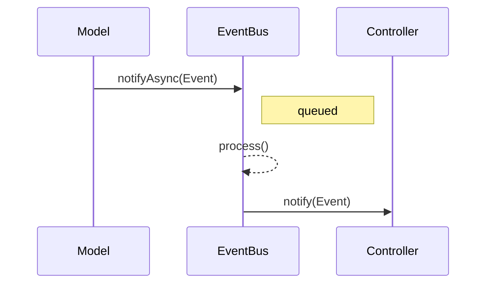

# ImGuiX

**ImGuiX** — объектно-ориентированный фреймворк поверх [Dear ImGui](https://github.com/ocornut/imgui).
Он предоставляет модульную архитектуру для создания **сложных многокнопочных UI** со следующим:

- **MVC-подобный дизайн** — окна, контроллеры и модели чётко разделены.
- **Событийное взаимодействие** — компоненты обмениваются сообщениями через внутреннюю шину.
- **Локальные модели фич** — контроллеры хранят лёгкие модели в типобезопасном реестре.
- **Расширяемость** — темы, шрифты, виджеты и контроллеры можно регистрировать и переиспользовать.
- **Поддержка разных бэкендов** — SFML, GLFW, SDL2 и Web/Emscripten.

В отличие от обычного ImGui, где UI обычно пишется в одной функции, ImGuiX вводит
**контроллеры, хуки жизненного цикла и менеджер окон**.
Это упрощает организацию больших приложений, переиспользование компонентов и тестирование логики
независимо от рендеринга.

> **Примечание:** ImGuiX сохраняет immediate-mode философию Dear ImGui,
> но структурирует её с помощью OOP, событийной шины и *MVC-подобной* архитектуры.
> Подробнее см. раздел [Архитектура](#архитектура).

## Оглавление

- [Быстрый старт](#быстрый-старт)
- [Особенности](#особенности)
- [Установка SDK](#установка-sdk)
- [Подключение как зависимость](#подключение-как-зависимость)
- [Быстрый старт / Примеры](#быстрый-старт--примеры)
- [Структура проекта](#структура-проекта)
- [Архитектура](#архитектура)
- [Web/Emscripten](#webemscripten)
- [Опции CMake (сводка)](#опции-cmake-сводка)
- [Макросы компиляции](#макросы-компиляции)
- [Темы](#темы)
- [Шрифты и лицензии](#шрифты-и-лицензии)
- [Лицензия](#лицензия)

## Быстрый старт

```cpp
#include <SFML/Graphics.hpp>
#include <imgui.h>
#include <imgui-SFML.h>

int main() {
    sf::RenderWindow window(sf::VideoMode(800, 600), "ImGuiX SDK template");
    window.setFramerateLimit(60);

    ImGui::CreateContext();
    ImGui::StyleColorsDark();
    ImGui::SFML::Init(window);

    bool show_demo = true;
    sf::Clock clk;

    while (window.isOpen()) {
        sf::Event ev;
        while (window.pollEvent(ev)) {
            ImGui::SFML::ProcessEvent(window, ev);
            if (ev.type == sf::Event::Closed) window.close();
        }

        ImGui::SFML::Update(window, clk.restart());

        if (show_demo) ImGui::ShowDemoWindow(&show_demo);
        ImGui::Begin("Hello");
        ImGui::Text("It works!");
        ImGui::End();

        window.clear();
        ImGui::SFML::Render(window);
        window.display();
    }
    ImGui::SFML::Shutdown();
    return 0;
}
```

## Особенности

- 💡 Архитектура, вдохновлённая MVC: контроллеры, модель, отображение
- 🔔 Встроенный EventBus для связи между компонентами
- 📦 Готовые контроллеры: SplashScreen, StartupMenu и другие
- 🌐 Мультиязычность через JSON-файлы
- ⚙️ Хранение настроек (файлы или база данных)
- 📊 Виджеты: таблицы, графики, элементы ввода
- ♻️ Поддержка вложенных контроллеров

## Установка SDK

Минимальный пример (Release, бэкенд SFML по умолчанию) собирает и устанавливает SDK в `dist/sdk-sfml`:

```bash
cmake -S . -B build -DCMAKE_BUILD_TYPE=Release ^
  -DIMGUIX_SDK_INSTALL=ON -DIMGUIX_SDK_BUNDLE_DEPS=ON ^
  -DCMAKE_INSTALL_PREFIX=%CD%/dist/sdk-sfml
cmake --build build --target install --config Release
```

Ключевые опции:

* `IMGUIX_SDK_INSTALL` — включает установку SDK (вместе с `install(...)` самой библиотеки).
* `IMGUIX_SDK_BUNDLE_DEPS` — кладёт во встроенный SDK внешние зависимости, если они собираются внутри (fmt, SFML, ImGui-SFML, libmdbx, nlohmann_json при вендоринге).
* `IMGUIX_SDK_INSTALL_QUICKSTART` — добавляет в SDK папку `quickstart/` с минимальным примером и ресурсами.
* `IMGUIX_SDK_FLATTEN_MISC_HEADERS` — дублирует `imgui_stdlib.h` и `imgui_freetype.h` в корень `include/` для удобного подключения.

> Примечание. В режиме `BUNDLED` или если зависимость собирается как сабмодуль и имеет собственный `install(...)`, её заголовки и библиотеки устанавливаются автоматически — мы не дублируем установку вручную.

## Подключение как зависимость

### Вариант A: через установленный SDK

```cmake
# Внешний проект CMake
cmake_minimum_required(VERSION 3.18)
project(MyApp CXX)

# Подсказываем CMake путь к SDK (где лежит lib/cmake/*)
list(PREPEND CMAKE_PREFIX_PATH "path/to/sdk-sfml")

# 1) Основная библиотека
find_package(ImGuiX CONFIG REQUIRED) # даёт цель ImGuiX::imguix

# 2) Бэкенд и его зависимости
find_package(SFML CONFIG REQUIRED COMPONENTS System Window Graphics)

# Статическая библиотека ImGui-SFML устанавливается в SDK/lib (headers — в SDK/include).
# Импортируем её как обычную библиотеку:
find_library(IMGUI_SFML_LIB NAMES ImGui-SFML PATHS ${CMAKE_PREFIX_PATH} PATH_SUFFIXES lib REQUIRED)

add_executable(myapp main.cpp)
target_link_libraries(myapp PRIVATE ImGuiX::imguix ${IMGUI_SFML_LIB} SFML::Graphics SFML::Window SFML::System)
```

### Вариант B: как сабмодуль

```cmake
# У верхнего проекта есть свои зависимости (пример):
find_package(fmt CONFIG REQUIRED)
# libmdbx: либо find_package(MDBX CONFIG), либо add_subdirectory(external/libmdbx) и alias mdbx::mdbx

set(IMGUIX_DEPS_MODE SYSTEM CACHE STRING "" FORCE) # запрещаем нашему сабмодулю тянуть bundled
add_subdirectory(external/ImGuiX)
target_link_libraries(myapp PRIVATE ImGuiX::imguix)
```

## Быстрый старт / Примеры

SDK может включать папку `quickstart/` с минимальным примером приложения. Скопируйте директорию `quickstart` в свой проект или добавьте её как исходники, соберите — и готово.

## Структура проекта

```
.
├── include/            # публичные заголовки
│   └── imguix/         # основные заголовки библиотеки
│       ├── config/     # конфигурационные помощники
│       ├── controllers/  # утилиты контроллеров
│       ├── core/       # модули ядра фреймворка
│       │   ├── application/ # приложение и контекст
│       │   ├── controller/  # базовый класс контроллера
│       │   ├── events/      # встроенные типы событий
│       │   ├── fonts/       # менеджер шрифтов
│       │   ├── i18n/        # интернационализация
│       │   ├── model/       # базовые классы моделей
│       │   ├── notify/      # уведомления
│       │   ├── options/     # хранилище опций
│       │   ├── pubsub/      # шина событий
│       │   ├── resource/    # реестр ресурсов
│       │   ├── themes/      # менеджер тем
│       │   └── window/      # оконные интерфейсы
│       ├── extensions/  # утилитарные расширения
│       ├── themes/      # встроенные темы
│       ├── utils/       # утилиты
│       ├── widgets/     # переиспользуемые виджеты
│       └── windows/     # утилиты окон
├── docs/               # документация проекта
├── examples/           # примерные приложения
│   └── quickstart/     # минимальный стартовый проект
├── libs/               # встроенные зависимости
├── src/                # исходники библиотеки
└── tests/              # тесты и демо
```

## Архитектура

Подробное описание см. в [docs/ARCHITECTURE-RU.md](docs/ARCHITECTURE-RU.md) (англоязычная версия: [docs/ARCHITECTURE.md](docs/ARCHITECTURE.md)).

ImGuiX объединяет философию Immediate Mode GUI с классическими паттернами проектирования:

- **Immediate-Mode MVC**
  - *View* → `WindowInstance` (представляет окно и его контекст рендеринга).
  - *Controller* → наследники `Controller` (совмещают логику и отрисовку кадра).
  - *Model* → `OptionsStore`, пользовательские данные или внешние бэкенды.

- **Событийное взаимодействие**
  Встроенный `EventBus` реализует паттерн Publisher–Subscriber.
  Контроллеры и модели обмениваются сообщениями без жёстких зависимостей.
  Хелперы вроде `EventMediator` упрощают подписки, а `EventAwaiter` поддерживает
  одноразовые ожидания и таймауты.

- **Жизненный цикл / Template Method**
  Окна и контроллеры предоставляют хуки (`onInit`, `drawContent`, `drawUi` и др.),
  которые вызываются циклом приложения, задавая единую структуру инициализации,
  логики кадра и очистки.

- **Фабрики**
  Контроллеры и модели создаются через фабричные методы.
  `WindowInstance` предоставляет `createController<T>()`, возвращающий
  ограниченный `WindowInterface&` и сохраняющий инварианты.

- **Стратегии и расширяемость**
  Темы, шрифты и виджеты регистрируются динамически, следуя паттерну Strategy
  для внешнего вида и поведения.

### Системный обзор



### Поток событий



## Web/Emscripten

Шаблон HTML для Web-сборки лежит в `assets` и попадает в `quickstart/` при включённом `IMGUIX_SDK_INSTALL_QUICKSTART`. Тестам он не нужен — `assets/data/web` исключается при копировании ассетов.

Для сборки ImGuiX под WebAssembly с использованием SDL2 и OpenGL ES 2.0 применяется `emcc` (из состава [Emscripten SDK](https://emscripten.org/)).

### ⚙️ Конфигурация через `emsdk-path.txt`

Чтобы не хардкодить пути к SDK и директории сборки, используется файл `emsdk-path.txt` в корне репозитория. Скрипты `build-test-sdl2-ems.bat` и `run-test-sdl2-ems.bat` читают его автоматически.

**Формат файла:**

```txt
D:/tools/emsdk
D:/repo/ImGuiX/build-test-sdl2-ems
```

- **1-я строка**: путь к установленному Emscripten SDK
- **2-я строка**: путь к директории сборки и запуска

### 📦 Зависимости

- [emsdk](https://emscripten.org/docs/getting_started/downloads.html) (активируется через `emsdk_env.bat`)
- [SDL2](https://emscripten.org/docs/porting/using_sdl.html) (через `-s USE_SDL=2`)
- [FreeType](https://emscripten.org/docs/porting/using_freetype.html) (через `-s USE_FREETYPE=1`)

### 🚀 Сборка и запуск

```bat
build-test-sdl2-ems.bat   :: собирает пример и кладёт index.html в указанную папку
run-test-sdl2-ems.bat     :: запускает emrun на локальном сервере
```

После сборки откройте `http://localhost:8081/index.html` в браузере.

## Опции CMake (сводка)

* `IMGUIX_HEADER_ONLY` — собрать только заголовки (без .cpp).
* `IMGUIX_BUILD_SHARED` — собрать `imguix` как `SHARED`.
* `IMGUIX_BUILD_TESTS` — собрать тесты из `tests/`.
* Выбор бэкенда:
  `IMGUIX_USE_SFML_BACKEND` (ON по умолчанию) / `IMGUIX_USE_GLFW_BACKEND` / `IMGUIX_USE_SDL2_BACKEND`.
* ImGui: `IMGUIX_IMGUI_FREETYPE` (включить FreeType), `IMGUIX_IMGUI_STDLIB` (по умолчанию включён для бэкендов, кроме SFML).
* JSON: `IMGUIX_VENDOR_JSON` — положить заголовки `nlohmann_json` в SDK.
* Режимы зависимостей:
  `IMGUIX_DEPS_MODE= AUTO|SYSTEM|BUNDLED` + пер-пакетные `IMGUIX_DEPS_*_MODE` (`fmt`, `SFML`, `ImGui`, `ImGui-SFML`, `freetype`, `json`, `mdbx`).

## Макросы компиляции

ImGuiX проверяет набор макросов для подключения дополнительных модулей. Они задаются автоматически при включении соответствующих опций CMake.

- `IMGUI_ENABLE_FREETYPE` — использование FreeType для растеризации шрифтов (`IMGUIX_IMGUI_FREETYPE`).
- `IMGUI_ENABLE_IMPLOT` — интеграция [ImPlot](https://github.com/epezent/implot) (`IMGUIX_USE_IMPLOT`).
- `IMGUI_ENABLE_IMPLOT3D` — интеграция [ImPlot3D](https://github.com/jimgries/implot3d) (`IMGUIX_USE_IMPLOT3D`).

Полный список конфигурационных макросов см. в [docs/CONFIGURATION-RU.md](docs/CONFIGURATION-RU.md).

## Темы

ImGuiX поставляется с набором встроенных цветовых тем и поддерживает пользовательские. Зарегистрируйте и примените тему:

```cpp
auto& tm = themeManager();
ImGuiX::Themes::registerCorporateGreyTheme(tm);
tm.setTheme(IMGUIX_THEME_CORPORATE_GREY);
```

Выбор и сохранение темы можно поручить виджетам:

```cpp
ImGuiX::Widgets::ApplyStoredTheme(this);
ImGuiX::Widgets::ThemePicker("demo.theme", this);
```

Полный список тем и API см. в [docs/THEMES.md](docs/THEMES.md).

## Шрифты и лицензии

ImGuiX поставляется с `FontManager`, который может автоматически загружать шрифты из JSON-конфига или настраиваться вручную. По умолчанию шрифты читаются из `data/resources/fonts/fonts.json`. Подробности см. в [FONTS-GUIDE-RU.md](docs/FONTS-GUIDE-RU.md).

#### Общие диапазоны символов

Поддерживаемые токены пресетов (добавляйте их в свою строку пресетов):

- `PUA` — `U+E000–U+F8FF` (иконные шрифты: Material, Font Awesome/Fork Awesome)
- `MiscSymbols` (`Misc`) — `U+2600–U+26FF` (⚠ ☀ ☂ ☺ …)
- `Dingbats` — `U+2700–U+27BF` (✂ ✈ ✔ ✖ …)
- `Arrows` — `U+2190–U+21FF` (← ↑ → ↔ …)

> **Примечание.** Диапазоны лишь открывают кодовые точки в атласе; нужен шрифт, который действительно содержит эти глифы.

> **Совет.** Иконные шрифты (Material, Font Awesome/Fork Awesome и т.п.) используют кодовые точки **Private Use Area (PUA)**. Включайте `PUA` в пресеты, чтобы иконки отображались вместе с текстом.

> **Предупреждение.** Каждый дополнительный диапазон и мердженный шрифт увеличивает размер атласа и количество глифов. Держите атлас в разумных пределах (≈4–8 MB). Проверяйте после `fontsBuildNow()` через *Metrics/Debugger → Fonts* или программно (`io.Fonts->TexWidth`, `TexHeight`).

### Пример настройки

Пример ручной настройки в `WindowInstance::onInit()`:

```cpp
fontsBeginManual();
// включаем иконки (PUA) + общие символы (стрелки/misc/dingbats)
fontsSetRangesPreset("Default+Punct+PUA+LatinExtA"); // LatinExtA для œ/Œ, æ/Æ и т.п.
fontsAddBody({ "Roboto-Medium.ttf", 16.0f });
// мерджим иконный шрифт (PUA); oversample=4.0f, merge=true
fontsAddMerge(FontRole::Icons, { "forkawesome-webfont.ttf", 16.0f, 4.0f, true });
// (опц.) мерджим шрифт с символами, если в Roboto нет глифов
// fontsAddMerge(ImGuiX::Fonts::FontRole::Symbols,{
//     "NotoSansSymbols-Regular.ttf", 16.0f, 1.0f, true
// });
fontsBuildNow();
```

#### Устранение неполадок

- **Иконка отображается как □/отсутствует:** убедитесь, что `PUA` есть в диапазонах **и** иконный шрифт замерджен.
- **Unicode-символы (⚠ ✈ ←) не рендерятся:** добавьте `MiscSymbols` / `Dingbats` / `Arrows` в диапазоны и мерджите шрифт, содержащий их.
- **Фолбэк для маркеров:** виджеты пробуют `U+26A0` (⚠) → `U+E002` (Material PUA) → `"(!)"`, если глифы отсутствуют.

> **Совет:** для западноевропейских языков (французский, польский, чешский и т.п.) рекомендуется добавить `+LatinExtA`, так как символы вроде `œ/Œ` находятся в блоке Latin Extended-A. При необходимости включайте `+Latin1Sup`, `+LatinExtB` или `+LatinExtAdditional`.

В репозитории поставляются сторонние шрифты под их исходными лицензиями:

- **Noto Sans (Latin/Cyrillic/Greek/Vietnamese)**, **Noto Sans CJK (SC/TC/JP/KR)**,
  **Noto Sans Arabic / Devanagari / Thai** — лицензия [SIL Open Font License 1.1](licenses/OFL.txt).
  Copyright © The Noto Project Authors.

- **Font Awesome Free (только шрифты)**, **Fork Awesome**, **Fontaudio** —
  [SIL Open Font License 1.1](licenses/OFL.txt).
  *Примечание:* брендовые иконки остаются объектом товарных знаков.

- **Material Icons**, **Roboto** — [Apache License 2.0](licenses/LICENSE-APACHE-2.0.txt)
  (см. также `licenses/NOTICE`, если предоставлен апстримом).

Все шрифты включены без изменений. См. `THIRD-PARTY-NOTICES.md` для указания авторства по семействам.

## Связанные проекты

ImGuiX включает ряд внешних библиотек в качестве git-сабмодулей:

- [Dear ImGui](https://github.com/ocornut/imgui) — базовая библиотека для immediate-mode UI.
- [fmt](https://github.com/fmtlib/fmt) — быстрый типобезопасный форматер строк для C++.
- [FreeType](https://github.com/freetype/freetype) — движок растеризации шрифтов.
- [GLFW](https://github.com/glfw/glfw) — кроссплатформенное создание окон, контекстов и ввод.
- [ImGui-SFML](https://github.com/SFML/imgui-sfml) — связывает Dear ImGui с SFML.
- [ImNodeFlow](https://github.com/Fattorino/ImNodeFlow) — редактор узлов и блюпринтов для Dear ImGui.
- [ImPlot](https://github.com/epezent/implot) — библиотека построения графиков для Dear ImGui.
- [ImPlot3D](https://github.com/brenocq/implot3d) — 3D-дополнение к ImPlot.
- [nlohmann/json](https://github.com/nlohmann/json) — заголовочная библиотека работы с JSON.
- [SFML](https://github.com/SFML/SFML) — Simple and Fast Multimedia Library для графики, аудио и окон.

## Лицензия

MIT — см. [LICENSE](./LICENSE)

