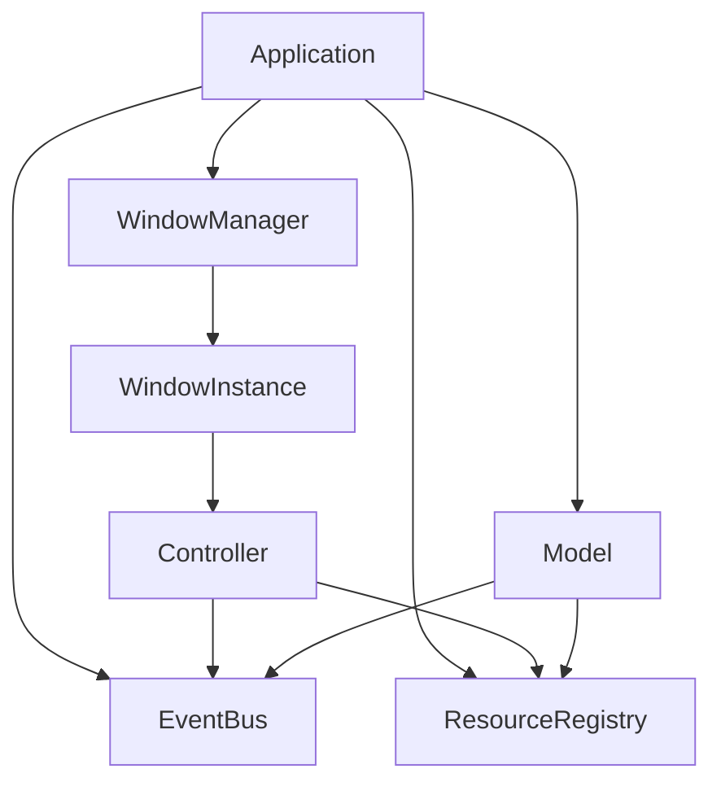
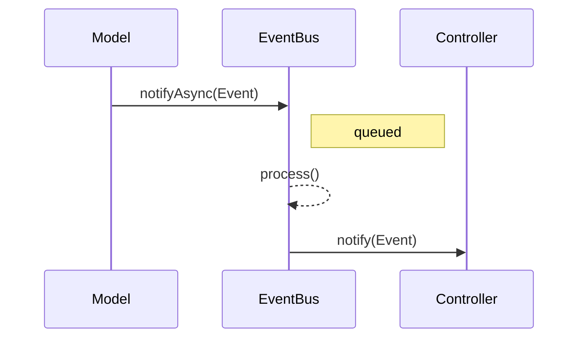

# ImGuiX

Объектно-ориентированная обёртка над [Dear ImGui](https://github.com/ocornut/imgui) для создания сложных пользовательских интерфейсов с модульными контроллерами, событийной архитектурой и принципами, вдохновлёнными MVC.

> **Примечание:** ImGuiX использует *MVC-like* архитектуру, подробнее см. раздел [Архитектура](#архитектура).

## Оглавление
- [Быстрый старт](#быстрый-старт)
- [Особенности](#особенности)
- [Установка (SDK)](#установка-sdk)
- [Подключение как зависимость](#подключение-как-зависимость)
- [Быстрый старт / Примеры](#быстрый-старт--примеры)
- [Архитектура](#архитектура)
- [Web/Emscripten](#webemscripten)
- [Опции CMake (сводка)](#опции-cmake-сводка)
- [Fonts and Licensing](#fonts-and-licensing)
- [Лицензия](#лицензия)

## Быстрый старт

```cpp
#include <SFML/Graphics.hpp>
#include <imgui.h>
#include <imgui-SFML.h>

int main() {
    sf::RenderWindow window(sf::VideoMode(800, 600), "ImGuiX SDK template");
    window.setFramerateLimit(60);

    ImGui::CreateContext();
    ImGui::StyleColorsDark();
    ImGui::SFML::Init(window);

    bool show_demo = true;
    sf::Clock clk;

    while (window.isOpen()) {
        sf::Event ev;
        while (window.pollEvent(ev)) {
            ImGui::SFML::ProcessEvent(window, ev);
            if (ev.type == sf::Event::Closed) window.close();
        }

        ImGui::SFML::Update(window, clk.restart());

        if (show_demo) ImGui::ShowDemoWindow(&show_demo);
        ImGui::Begin("Hello");
        ImGui::Text("It works!");
        ImGui::End();

        window.clear();
        ImGui::SFML::Render(window);
        window.display();
    }
    ImGui::SFML::Shutdown();
    return 0;
}
```

## Особенности

- 💡 Архитектура, вдохновлённая MVC: контроллеры, модель, отображение
- 🔔 Встроенный EventBus: для связи между компонентами
- 📦 Готовые контроллеры: SplashScreen, StartupMenu и другие
- 🌐 Поддержка мультиязычности через JSON-файлы
- ⚙️ Хранение настроек (файлы или БД)
- 📊 Виджеты: таблицы, графики, элементы ввода
- ♻️ Поддержка вложенных контроллеров

## Установка (SDK)

Минимальный пример (Release, SFML-бэкенд по умолчанию), соберёт и установит SDK в `dist/sdk-sfml`:

```bash
cmake -S . -B build -DCMAKE_BUILD_TYPE=Release ^
  -DIMGUIX_SDK_INSTALL=ON -DIMGUIX_SDK_BUNDLE_DEPS=ON ^
  -DCMAKE_INSTALL_PREFIX=%CD%/dist/sdk-sfml
cmake --build build --target install --config Release
```

Ключевые опции:

* `IMGUIX_SDK_INSTALL` — включает установку SDK (вместе с `install(...)` нашей библиотеки).
* `IMGUIX_SDK_BUNDLE_DEPS` — кладёт в SDK внешние зависимости, если мы их собрали внутри (fmt, SFML, ImGui-SFML, libmdbx, nlohmann_json при вендоринге).
* `IMGUIX_SDK_INSTALL_QUICKSTART` — добавляет в SDK папку `quickstart/` с минимальным примером и ресурсами.
* `IMGUIX_SDK_FLATTEN_MISC_HEADERS` — дублирует `imgui_stdlib.h` и `imgui_freetype.h` в корень `include/` для удобных инклюдов.

> Примечание. При режиме `BUNDLED` или если зависимость собрана как сабмодуль и имеет свой `install(...)`, установка их хедеров/библиотек происходит автоматически — мы это учитываем и не дублируем ручной установкой.

## Подключение как зависимость

### Вариант A: через установленный SDK

```cmake
# Внешний проект CMake
cmake_minimum_required(VERSION 3.18)
project(MyApp CXX)

# Подсказываем CMake путь к SDK (где лежит lib/cmake/*)
list(PREPEND CMAKE_PREFIX_PATH "path/to/sdk-sfml")

# 1) Основная библиотека
find_package(ImGuiX CONFIG REQUIRED) # даёт цель ImGuiX::imguix

# 2) Бэкенд и его зависимости
find_package(SFML CONFIG REQUIRED COMPONENTS System Window Graphics)

# Статическая библиотека ImGui-SFML устанавливается в SDK/lib (headers — в SDK/include).
# Импортируем её как обычную библиотеку:
find_library(IMGUI_SFML_LIB NAMES ImGui-SFML PATHS ${CMAKE_PREFIX_PATH} PATH_SUFFIXES lib REQUIRED)

add_executable(myapp main.cpp)
target_link_libraries(myapp PRIVATE ImGuiX::imguix ${IMGUI_SFML_LIB} SFML::Graphics SFML::Window SFML::System)
```

### Вариант B: как сабмодуль

```cmake
# У верхнего проекта есть свои зависимости (пример):
find_package(fmt CONFIG REQUIRED)
# libmdbx: либо find_package(MDBX CONFIG), либо add_subdirectory(external/libmdbx) и alias mdbx::mdbx

set(IMGUIX_DEPS_MODE SYSTEM CACHE STRING "" FORCE) # запрещаем нашему сабмодулю тянуть bundled
add_subdirectory(external/ImGuiX)
target_link_libraries(myapp PRIVATE ImGuiX::imguix)
```

## Быстрый старт / Примеры

В SDK можно включить `quickstart/` с минимальным примером приложения.
Скопируй папку `quickstart` в свой проект или укажи её как исходники, собери — и стартуй.

## Архитектура

ImGuiX следует адаптированному под Immediate Mode GUI подходу, напоминающему **MVC**.

В отличие от классического *MVC*, здесь роли *View* и *Controller* объединены: каждый контроллер отвечает и за логику, и за отрисовку виджетов в одном кадре. Модели взаимодействуют с контроллерами через событийную шину (EventBus), что обеспечивает слабую связанность и гибкую маршрутизацию событий.

### System Map

#### Компоненты



#### Поток событий



## Web/Emscripten

Шаблон HTML лежит в `assets` для Web-сборки и попадает в `quickstart/` при включённом `IMGUIX_SDK_INSTALL_QUICKSTART`.
Тестам он не нужен — для них мы исключаем `assets/data/web` при копировании ассетов.

Для сборки ImGuiX под WebAssembly с использованием SDL2 и OpenGL ES 2.0, используется `emcc` (из состава [Emscripten SDK](https://emscripten.org/)).

### ⚙️ Конфигурация через `emsdk-path.txt`

Чтобы не хардкодить пути к SDK и директории сборки, используется файл `emsdk-path.txt` в корне репозитория. Скрипты `build-test-sdl2-ems.bat` и `run-test-sdl2-ems.bat` автоматически читают его.

**Формат файла:**

```txt
D:/tools/emsdk
D:/repo/ImGuiX/build-test-sdl2-ems
```

- **1-я строка**: путь к установленному Emscripten SDK
- **2-я строка**: путь к директории сборки и запуска

### 📦 Зависимости

- [emsdk](https://emscripten.org/docs/getting_started/downloads.html) (активирован через `emsdk_env.bat`)
- [SDL2](https://emscripten.org/docs/porting/using_sdl.html) (через `-s USE_SDL=2`)
- [FreeType](https://emscripten.org/docs/porting/using_freetype.html) (через `-s USE_FREETYPE=1`)

### 🚀 Сборка и запуск

```bat
build-test-sdl2-ems.bat   :: собирает пример и кладёт index.html в указанную папку
run-test-sdl2-ems.bat     :: запускает emrun на локальном сервере
```

После сборки можно открыть `http://localhost:8081/index.html` в браузере.

## Опции CMake (сводка)

* `IMGUIX_HEADER_ONLY` — собрать только заголовки (без .cpp).
* `IMGUIX_BUILD_SHARED` — собрать `imguix` как `SHARED`.
* `IMGUIX_BUILD_TESTS` — собрать тесты из `tests/`.
* Выбор бэкенда:
  `IMGUIX_USE_SFML_BACKEND` (ON по умолчанию) / `IMGUIX_USE_GLFW_BACKEND` / `IMGUIX_USE_SDL2_BACKEND`.
* ImGui: `IMGUIX_IMGUI_FREETYPE` (включает FreeType), `IMGUIX_IMGUI_STDLIB` (для не-SFML бэкендов включается по умолчанию).
* JSON: `IMGUIX_VENDOR_JSON` — положить заголовки `nlohmann_json` в SDK.
* Режимы зависимостей:
  `IMGUIX_DEPS_MODE= AUTO|SYSTEM|BUNDLED` + пер-пакетные `IMGUIX_DEPS_*_MODE` (`fmt`, `SFML`, `ImGui`, `ImGui-SFML`, `freetype`, `json`, `mdbx`).

## Fonts and Licensing

For font usage instructions see [FONTS-GUIDE-RU.md](docs/FONTS-GUIDE-RU.md).

This repository bundles third-party fonts under their original licenses:

- **Noto Sans (Latin/Cyrillic/Greek/Vietnamese)**, **Noto Sans CJK (SC/TC/JP/KR)**,
  **Noto Sans Arabic / Devanagari / Thai** — licensed under the
  [SIL Open Font License 1.1](licenses/OFL.txt).
  Copyright © The Noto Project Authors.

- **Font Awesome Free (fonts only)**, **Fork Awesome**, **Fontaudio** —
  [SIL Open Font License 1.1](licenses/OFL.txt).
  *Note:* brand icons remain subject to trademark rights.

- **Material Icons**, **Roboto** — [Apache License 2.0](licenses/LICENSE-APACHE-2.0.txt)
  (see also `licenses/NOTICE` if provided upstream).

All fonts are included unmodified. See `THIRD-PARTY-NOTICES.md` for per-family attributions.

## Лицензия

MIT — см. [LICENSE](./LICENSE)

