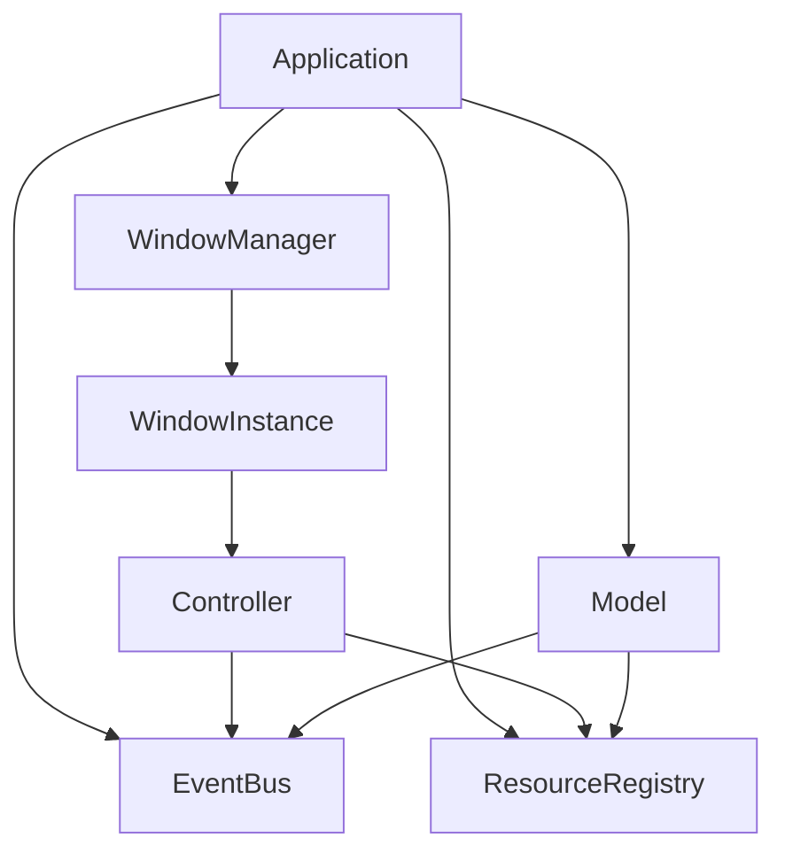
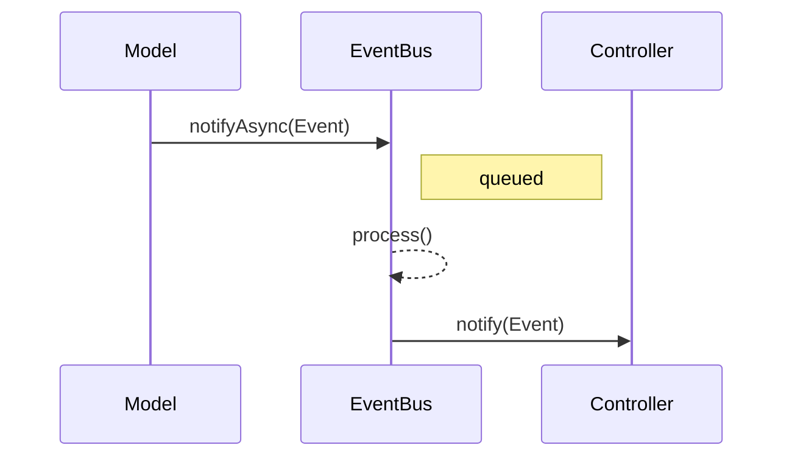

# ImGuiX

**ImGuiX** — это объектно-ориентированная обёртка над [Dear ImGui](https://github.com/ocornut/imgui), которая упрощает создание сложных пользовательских интерфейсов с использованием модульных контроллеров, событийной архитектуры и принципов, вдохновлённых паттерном MVC.

Библиотека предназначена для тех, кто хочет структурировать UI через классы, управлять экранами через контроллеры, обрабатывать события через EventBus и легко расширять интерфейс новыми компонентами.

> **Примечание:** ImGuiX использует *MVC-like* архитектуру, подробнее см. раздел [Архитектура](#архитектура).

## Архитектура

ImGuiX следует адаптированному под Immediate Mode GUI подходу, напоминающему **MVC**.

В отличие от классического *MVC*, здесь роли *View* и *Controller* объединены: каждый контроллер отвечает и за логику, и за отрисовку виджетов в одном кадре. Модели взаимодействуют с контроллерами через событийную шину (EventBus), что обеспечивает слабую связанность и гибкую маршрутизацию событий.

### System Map

#### Компоненты



#### Поток событий



## Особенности

- 💡 Архитектура, вдохновлённая MVC: контроллеры, модель, отображение
- 🔔 Встроенный EventBus: для связи между компонентами
- 📦 Готовые контроллеры: SplashScreen, StartupMenu и другие
- 🌐 Поддержка мультиязычности через JSON-файлы
- ⚙️ Хранение настроек (файлы или БД)
- 📊 Виджеты: таблицы, графики, элементы ввода
- ♻️ Поддержка вложенных контроллеров

## Установка

(описание будет позже)

## 🔧 Сборка под WebAssembly (Emscripten)

Для сборки ImGuiX под WebAssembly с использованием SDL2 и OpenGL ES 2.0, используется `emcc` (из состава [Emscripten SDK](https://emscripten.org/)).

### ⚙️ Конфигурация через `emsdk-path.txt`

Чтобы не хардкодить пути к SDK и директории сборки, используется файл `emsdk-path.txt` в корне репозитория. Скрипты `build-test-sdl2-ems.bat` и `run-test-sdl2-ems.bat` автоматически читают его.

**Формат файла:**
```txt
D:/tools/emsdk
D:/repo/ImGuiX/build-test-sdl2-ems
```

- **1-я строка**: путь к установленному Emscripten SDK
- **2-я строка**: путь к директории сборки и запуска

### 📦 Зависимости

- [emsdk](https://emscripten.org/docs/getting_started/downloads.html) (активирован через `emsdk_env.bat`)
- [SDL2](https://emscripten.org/docs/porting/using_sdl.html) (через `-s USE_SDL=2`)
- [FreeType](https://emscripten.org/docs/porting/using_freetype.html) (через `-s USE_FREETYPE=1`)

### 🚀 Сборка и запуск

```bat
build-test-sdl2-ems.bat   :: собирает пример и кладёт index.html в указанную папку
run-test-sdl2-ems.bat     :: запускает emrun на локальном сервере
```

После сборки можно открыть `http://localhost:8081/index.html` в браузере.

## Fonts and Licensing

This repository includes third-party font files under the following licenses:

- **FontAwesome, ForkAwesome, Fontaudio** – licensed under the [SIL Open Font License 1.1](licenses/OFL.txt)
- **Material Icons, Roboto** – licensed under the [Apache License 2.0](licenses/LICENSE-APACHE-2.0.txt)

All fonts are used as-is, without modification. See individual font licenses for more details.

## Лицензия

MIT — см. [LICENSE](./LICENSE)
