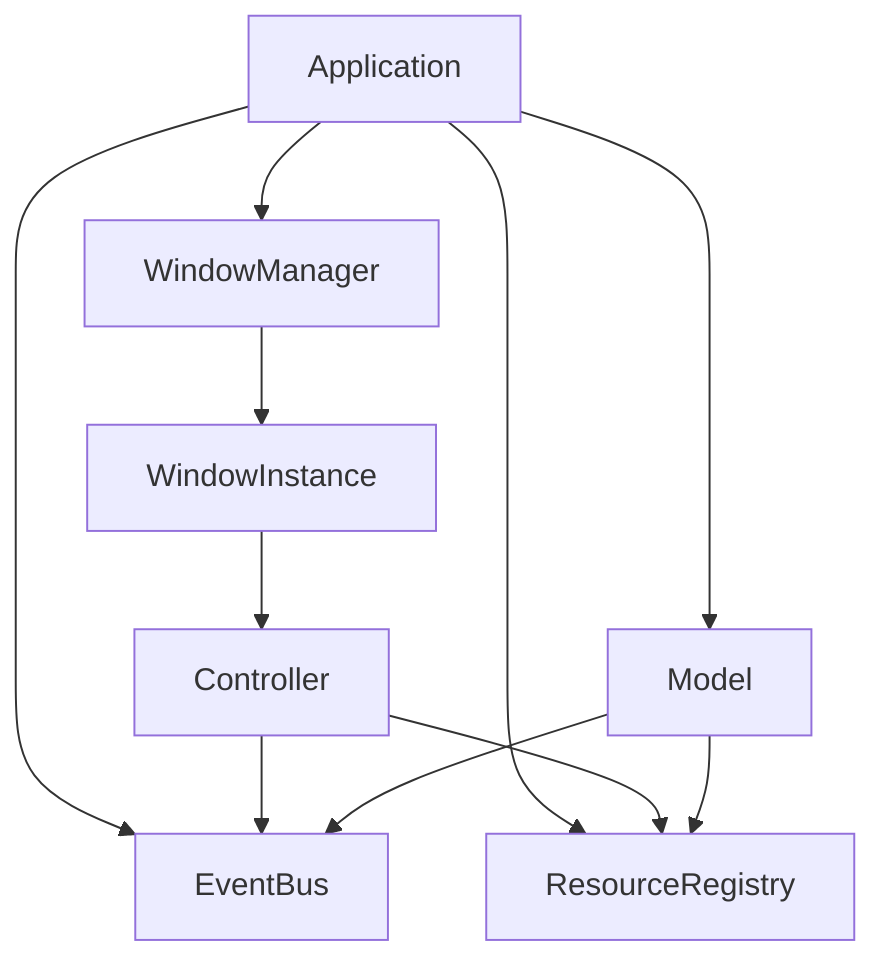
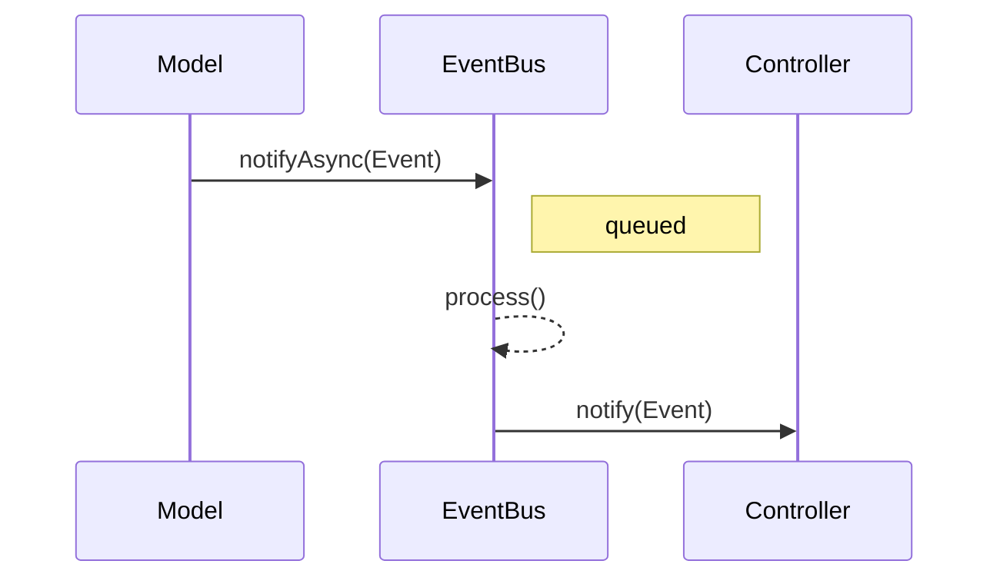

# ImGuiX

An object-oriented wrapper around [Dear ImGui](https://github.com/ocornut/imgui) for building complex user interfaces with modular controllers, an event-driven architecture, and MVC-inspired principles.

> **Note:** ImGuiX uses an *MVC-like* architecture. See [Architecture](#architecture) for details.

## Table of Contents
- [Quick Start](#quick-start)
- [Features](#features)
- [SDK Installation](#sdk-installation)
- [Using as a Dependency](#using-as-a-dependency)
- [Quick Start / Examples](#quick-start--examples)
- [Architecture](#architecture)
- [Web/Emscripten](#webemscripten)
- [CMake Options (Summary)](#cmake-options-summary)
- [Fonts and Licensing](#fonts-and-licensing)
- [License](#license)

## Quick Start

```cpp
#include <SFML/Graphics.hpp>
#include <imgui.h>
#include <imgui-SFML.h>

int main() {
    sf::RenderWindow window(sf::VideoMode(800, 600), "ImGuiX SDK template");
    window.setFramerateLimit(60);

    ImGui::CreateContext();
    ImGui::StyleColorsDark();
    ImGui::SFML::Init(window);

    bool show_demo = true;
    sf::Clock clk;

    while (window.isOpen()) {
        sf::Event ev;
        while (window.pollEvent(ev)) {
            ImGui::SFML::ProcessEvent(window, ev);
            if (ev.type == sf::Event::Closed) window.close();
        }

        ImGui::SFML::Update(window, clk.restart());

        if (show_demo) ImGui::ShowDemoWindow(&show_demo);
        ImGui::Begin("Hello");
        ImGui::Text("It works!");
        ImGui::End();

        window.clear();
        ImGui::SFML::Render(window);
        window.display();
    }
    ImGui::SFML::Shutdown();
    return 0;
}
```

## Features

- 💡 MVC-inspired architecture: controllers, model, view
- 🔔 Built-in EventBus for communication between components
- 📦 Ready-made controllers: SplashScreen, StartupMenu and others
- 🌐 Multilingual support through JSON files
- ⚙️ Settings storage (files or a database)
- 📊 Widgets: tables, charts, input elements
- ♻️ Nested controller support

## SDK Installation

A minimal example (Release, SFML backend by default) builds and installs the SDK into `dist/sdk-sfml`:

```bash
cmake -S . -B build -DCMAKE_BUILD_TYPE=Release ^
  -DIMGUIX_SDK_INSTALL=ON -DIMGUIX_SDK_BUNDLE_DEPS=ON ^
  -DCMAKE_INSTALL_PREFIX=%CD%/dist/sdk-sfml
cmake --build build --target install --config Release
```

Key options:

* `IMGUIX_SDK_INSTALL` — enables SDK installation (together with the library's `install(...)`).
* `IMGUIX_SDK_BUNDLE_DEPS` — places external dependencies into the SDK if they are built internally (fmt, SFML, ImGui-SFML, libmdbx, nlohmann_json when vendored).
* `IMGUIX_SDK_INSTALL_QUICKSTART` — adds a `quickstart/` folder with a minimal example and resources.
* `IMGUIX_SDK_FLATTEN_MISC_HEADERS` — duplicates `imgui_stdlib.h` and `imgui_freetype.h` into the `include/` root for convenient includes.

> Note. In `BUNDLED` mode or if a dependency is built as a submodule and has its own `install(...)`, its headers/libraries are installed automatically—we account for that and do not duplicate installation manually.

## Using as a Dependency

### Option A: via installed SDK

```cmake
# External CMake project
cmake_minimum_required(VERSION 3.18)
project(MyApp CXX)

# Tell CMake where the SDK (with lib/cmake/*) resides
list(PREPEND CMAKE_PREFIX_PATH "path/to/sdk-sfml")

# 1) Main library
find_package(ImGuiX CONFIG REQUIRED) # provides target ImGuiX::imguix

# 2) Backend and its dependencies
find_package(SFML CONFIG REQUIRED COMPONENTS System Window Graphics)

# ImGui-SFML static library is installed to SDK/lib (headers in SDK/include).
# Import it as a regular library:
find_library(IMGUI_SFML_LIB NAMES ImGui-SFML PATHS ${CMAKE_PREFIX_PATH} PATH_SUFFIXES lib REQUIRED)

add_executable(myapp main.cpp)
target_link_libraries(myapp PRIVATE ImGuiX::imguix ${IMGUI_SFML_LIB} SFML::Graphics SFML::Window SFML::System)
```

### Option B: as a submodule

```cmake
# The top-level project has its own dependencies (example):
find_package(fmt CONFIG REQUIRED)
# libmdbx: either find_package(MDBX CONFIG) or add_subdirectory(external/libmdbx) and alias mdbx::mdbx

set(IMGUIX_DEPS_MODE SYSTEM CACHE STRING "" FORCE) # forbid our submodule from pulling bundled deps
add_subdirectory(external/ImGuiX)
target_link_libraries(myapp PRIVATE ImGuiX::imguix)
```

## Quick Start / Examples

The SDK can include a `quickstart/` folder with a minimal application example. Copy the `quickstart` directory into your project or add it as sources, build, and you're ready to go.

## Architecture

ImGuiX follows an Immediate Mode GUI approach reminiscent of **MVC**.

Unlike classic *MVC*, here the roles of *View* and *Controller* are combined: each controller handles both logic and widget rendering within a single frame. Models interact with controllers through an event bus (EventBus), providing loose coupling and flexible event routing.

### System Map

#### Components



#### Event Flow



## Web/Emscripten

The HTML template for the Web build lives in `assets` and is included in `quickstart/` when `IMGUIX_SDK_INSTALL_QUICKSTART` is enabled. Tests do not need it—`assets/data/web` is excluded when copying assets for tests.

To build ImGuiX for WebAssembly using SDL2 and OpenGL ES 2.0, use `emcc` (from the [Emscripten SDK](https://emscripten.org/)).

### ⚙️ Configuration via `emsdk-path.txt`

To avoid hardcoding paths to the SDK and build directory, an `emsdk-path.txt` file in the repository root is used. The scripts `build-test-sdl2-ems.bat` and `run-test-sdl2-ems.bat` read it automatically.

**File format:**

```txt
D:/tools/emsdk
D:/repo/ImGuiX/build-test-sdl2-ems
```

- **Line 1**: path to the installed Emscripten SDK
- **Line 2**: path to the build and run directory

### 📦 Dependencies

- [emsdk](https://emscripten.org/docs/getting_started/downloads.html) (activated via `emsdk_env.bat`)
- [SDL2](https://emscripten.org/docs/porting/using_sdl.html) (via `-s USE_SDL=2`)
- [FreeType](https://emscripten.org/docs/porting/using_freetype.html) (via `-s USE_FREETYPE=1`)

### 🚀 Build and Run

```bat
build-test-sdl2-ems.bat   :: builds the sample and places index.html in the specified folder
run-test-sdl2-ems.bat     :: launches emrun on a local server
```

After building, open `http://localhost:8081/index.html` in your browser.

## CMake Options (Summary)

* `IMGUIX_HEADER_ONLY` — build headers only (no .cpp files).
* `IMGUIX_BUILD_SHARED` — build `imguix` as a `SHARED` library.
* `IMGUIX_BUILD_TESTS` — build tests from `tests/`.
* Backend selection:
  `IMGUIX_USE_SFML_BACKEND` (ON by default) / `IMGUIX_USE_GLFW_BACKEND` / `IMGUIX_USE_SDL2_BACKEND`.
* ImGui: `IMGUIX_IMGUI_FREETYPE` (enable FreeType), `IMGUIX_IMGUI_STDLIB` (enabled by default for non-SFML backends).
* JSON: `IMGUIX_VENDOR_JSON` — place `nlohmann_json` headers in the SDK.
* Dependency modes:
  `IMGUIX_DEPS_MODE= AUTO|SYSTEM|BUNDLED` plus per-package `IMGUIX_DEPS_*_MODE` (`fmt`, `SFML`, `ImGui`, `ImGui-SFML`, `freetype`, `json`, `mdbx`).

## Fonts and Licensing

For font usage instructions see [FONTS-GUIDE-RU.md](docs/FONTS-GUIDE-RU.md).

This repository bundles third-party fonts under their original licenses:

- **Noto Sans (Latin/Cyrillic/Greek/Vietnamese)**, **Noto Sans CJK (SC/TC/JP/KR)**,
  **Noto Sans Arabic / Devanagari / Thai** — licensed under the
  [SIL Open Font License 1.1](licenses/OFL.txt).
  Copyright © The Noto Project Authors.

- **Font Awesome Free (fonts only)**, **Fork Awesome**, **Fontaudio** —
  [SIL Open Font License 1.1](licenses/OFL.txt).
  *Note:* brand icons remain subject to trademark rights.

- **Material Icons**, **Roboto** — [Apache License 2.0](licenses/LICENSE-APACHE-2.0.txt)
  (see also `licenses/NOTICE` if provided upstream).

All fonts are included unmodified. See `THIRD-PARTY-NOTICES.md` for per-family attributions.

## License

MIT — see [LICENSE](./LICENSE)
