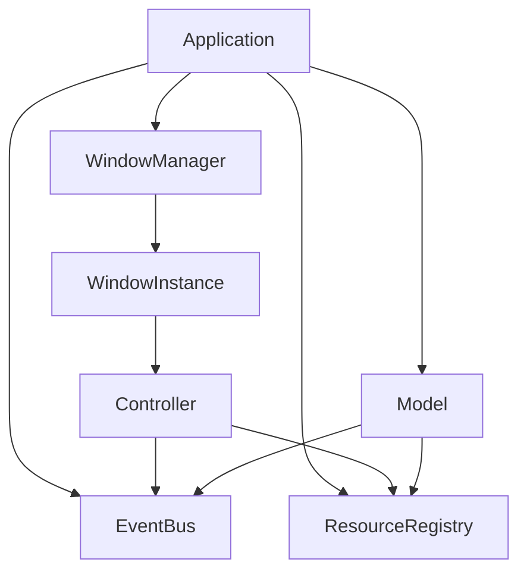
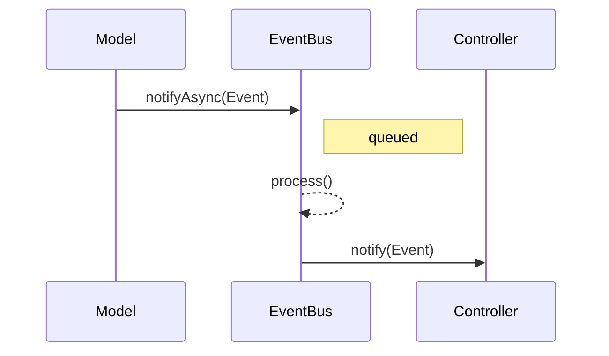

# ImGuiX

ImGuiX is an object-oriented framework built on top of [Dear ImGui](https://github.com/ocornut/imgui).  
It provides a modular architecture for building **complex, multi-window UIs** with:

- **MVC-inspired design** — windows, controllers, and models are clearly separated.
- **Event-driven communication** — components interact through an internal event bus.
- **Feature-local models** — define small `FeatureModel` classes per controller via
  `FeatureAccessMixin`. See [Feature Models](docs/ARCHITECTURE.md#feature-models).
- **Extensibility** — themes, fonts, widgets, and controllers can be registered and reused.
- **Cross-backend support** — SFML, GLFW, SDL2, and Web/Emscripten.

Unlike raw ImGui, where UI is typically coded in a single function, ImGuiX introduces
**controllers, lifecycle hooks, and a window manager**.  
This makes it easier to organize large applications, reuse components, and test logic
independently of rendering.

> **Note:** ImGuiX keeps the immediate-mode philosophy of Dear ImGui,  
> but structures it with OOP, an event bus, and an *MVC-like* architecture.  
> See [Architecture](#architecture) for details.


## Table of Contents

- [Quick Start](#quick-start)
- [Features](#features)
- [SDK Installation](#sdk-installation)
- [Using as a Dependency](#using-as-a-dependency)
- [Quick Start / Examples](#quick-start--examples)
- [Project Structure](#project-structure)
- [Architecture](#architecture)
- [Web/Emscripten](#webemscripten)
- [CMake Options (Summary)](#cmake-options-summary)
- [Compile-Time Macros](#compile-time-macros)
- [Themes](#themes)
- [Internationalization](#internationalization)
- [Fonts and Licensing](#fonts-and-licensing)
- [License](#license)

For the Russian version, see [README-RU.md](README-RU.md).

## Quick Start

Minimal ImGuiX application with a single framed window and controller:

```cpp
#define IMGUIX_HEADER_ONLY
#define IMGUIX_DEMO

#include <imguix/core.hpp>
#include <imguix/windows/ImGuiFramedWindow.hpp>
#include <imguix/controllers/ExtendedController.hpp>

class HelloController : public ImGuiX::Controllers::ExtendedController {
public:
    using ExtendedController::ExtendedController;

    void drawUi() override {
        ImGui::Begin("Hello");
        ImGui::Text("It works!");
        ImGui::End();
    }
};

class HelloWindow : public ImGuiX::Windows::ImGuiFramedWindow {
public:
    using ImGuiFramedWindow::ImGuiFramedWindow;

    void onInit() override {
        createController<HelloController>();
        create(800, 600);
    }
};

int main() {
    ImGuiX::Application app;
    app.createWindow<HelloWindow>("main", "ImGuiX Quick Start");
    app.run();
    return 0;
}
```

## Features

- 💡 MVC-inspired architecture: controllers, model, view
- 🔔 Built-in EventBus for communication between components
- 🧩 Feature-local models via `FeatureModel` and `FeatureAccessMixin`
- 📦 Ready-made controllers: SplashScreen, StartupMenu and others
- 🌐 Multilingual support through JSON files
- ⚙️ Settings storage (files or a database)
- 📊 Widgets: tables, charts, input elements
- ♻️ Nested controller support

## SDK Installation

A minimal example (Release, SFML backend by default) builds and installs the SDK into `dist/sdk-sfml`:

```bash
cmake -S . -B build -DCMAKE_BUILD_TYPE=Release ^
  -DIMGUIX_SDK_INSTALL=ON -DIMGUIX_SDK_BUNDLE_DEPS=ON ^
  -DCMAKE_INSTALL_PREFIX=%CD%/dist/sdk-sfml
cmake --build build --target install --config Release
```

Key options:

* `IMGUIX_SDK_INSTALL` — enables SDK installation (together with the library's `install(...)`).
* `IMGUIX_SDK_BUNDLE_DEPS` — places external dependencies into the SDK if they are built internally (fmt, SFML, ImGui-SFML, nlohmann_json when vendored).
* `IMGUIX_SDK_INSTALL_QUICKSTART` — adds a `quickstart/` folder with a minimal example and resources.
* `IMGUIX_SDK_FLATTEN_MISC_HEADERS` — duplicates `imgui_stdlib.h` and `imgui_freetype.h` into the `include/` root for convenient includes.

> Note. In `BUNDLED` mode or if a dependency is built as a submodule and has its own `install(...)`, its headers/libraries are installed automatically—we account for that and do not duplicate installation manually.

## Using as a Dependency

### Option A: via installed SDK

```cmake
# External CMake project
cmake_minimum_required(VERSION 3.18)
project(MyApp CXX)

# Tell CMake where the SDK (with lib/cmake/*) resides
list(PREPEND CMAKE_PREFIX_PATH "path/to/sdk-sfml")

# 1) Main library
find_package(ImGuiX CONFIG REQUIRED) # provides target ImGuiX::imguix

# 2) Backend and its dependencies
find_package(SFML CONFIG REQUIRED COMPONENTS System Window Graphics)

# ImGui-SFML static library is installed to SDK/lib (headers in SDK/include).
# Import it as a regular library:
find_library(IMGUI_SFML_LIB NAMES ImGui-SFML PATHS ${CMAKE_PREFIX_PATH} PATH_SUFFIXES lib REQUIRED)

add_executable(myapp main.cpp)
target_link_libraries(myapp PRIVATE ImGuiX::imguix ${IMGUI_SFML_LIB} SFML::Graphics SFML::Window SFML::System)
```

### Option B: as a submodule

```cmake
# The top-level project has its own dependencies (example):
find_package(fmt CONFIG REQUIRED)

set(IMGUIX_DEPS_MODE SYSTEM CACHE STRING "" FORCE) # forbid our submodule from pulling bundled deps
add_subdirectory(external/ImGuiX)
target_link_libraries(myapp PRIVATE ImGuiX::imguix)
```

## Quick Start / Examples

The SDK can include a `quickstart/` folder with a minimal application example. Copy the `quickstart` directory into your project or add it as sources, build, and you're ready to go.

## Project Structure

```
.
├── include/            # public headers
│   └── imguix/         # main library headers
│       ├── config/     # configuration helpers
│       ├── controllers/  # controller utilities
│       ├── core/       # core framework modules
│       │   ├── application/ # application and context
│       │   ├── controller/  # base controller class
│       │   ├── events/      # built-in event types
│       │   ├── fonts/       # font manager
│       │   ├── i18n/        # internationalization
│       │   ├── model/       # model base classes
│       │   ├── notify/      # notifications
│       │   ├── options/     # options storage
│       │   ├── pubsub/      # event bus
│       │   ├── resource/    # resource registry
│       │   ├── themes/      # theme manager
│       │   └── window/      # window interfaces
│       ├── extensions/  # utility extensions
│       ├── themes/      # built-in themes
│       ├── utils/       # utility functions
│       ├── widgets/     # reusable widgets
│       └── windows/     # window helpers
├── docs/               # project documentation
├── examples/           # sample applications
│   └── quickstart/     # minimal starter project
├── libs/               # bundled dependencies
├── src/                # library sources
└── tests/              # tests and demos
```

## Architecture

See [docs/ARCHITECTURE.md](docs/ARCHITECTURE.md) for a full overview (Russian version: [docs/ARCHITECTURE-RU.md](docs/ARCHITECTURE-RU.md)).

ImGuiX combines the **Immediate Mode GUI paradigm** with classical design patterns:

- **Immediate-Mode MVC**  
  - *View* → `WindowInstance` (represents a window and its rendering context).  
  - *Controller* → subclasses of `Controller` (combine per-frame rendering and logic).  
  - *Model* → `OptionsStore`, user data, or external backends.  

- **Event-driven communication**  
  The built-in `EventBus` implements a **Publisher–Subscriber** pattern.  
  Controllers and models exchange messages without direct dependencies.  
  Helpers like `EventMediator` simplify subscriptions, while `EventAwaiter` supports
  one-shot waits and timeouts.

- **Lifecycle / Template Method**  
  Windows and controllers expose hooks (`onInit`, `drawContent`, `drawUi`, …) that are
  invoked by the application loop, giving a consistent structure for initialization,
  per-frame logic, and cleanup.

- **Factories**  
  Controllers and models are created through factory methods.  
  `WindowInstance` exposes `createController<T>()` which provides only a restricted
  `WindowInterface&`, preserving invariants.

- **Strategies / Extensibility**  
  Themes, fonts, and widgets can be registered dynamically, following a Strategy-like
  pattern for appearance and behavior.

### System Overview


```mermaid
graph TD
    A[Application]
    WM[WindowManager]
    W[WindowInstance]
    C[Controller]
    M[Model]
    EB[EventBus]
    RR[ResourceRegistry]

    A-->WM
    A-->M
    A-->EB
    A-->RR
    WM-->W
    W-->C
    C-->EB
    M-->EB
    C-->RR
    M-->RR
```

### Event Flow


```mermaid
sequenceDiagram
    participant Model
    participant EventBus
    participant Controller
    Model->>EventBus: notifyAsync(Event)
    Note right of EventBus: queued
    EventBus-->>EventBus: process()
    EventBus->>Controller: notify(Event)
```

## Web/Emscripten

The HTML template for the Web build lives in `assets` and is included in `quickstart/` when `IMGUIX_SDK_INSTALL_QUICKSTART` is enabled. Tests do not need it—`assets/data/web` is excluded when copying assets for tests.

To build ImGuiX for WebAssembly using SDL2 and OpenGL ES 2.0, use `emcc` (from the [Emscripten SDK](https://emscripten.org/)).

### ⚙️ Configuration via `emsdk-path.txt`

To avoid hardcoding paths to the SDK and build directory, an `emsdk-path.txt` file in the repository root is used. The scripts `build-test-sdl2-ems.bat` and `run-test-sdl2-ems.bat` read it automatically.

**File format:**

```txt
D:/tools/emsdk
D:/repo/ImGuiX/build-test-sdl2-ems
```

- **Line 1**: path to the installed Emscripten SDK
- **Line 2**: path to the build and run directory

### 📦 Dependencies

- [emsdk](https://emscripten.org/docs/getting_started/downloads.html) (activated via `emsdk_env.bat`)
- [SDL2](https://emscripten.org/docs/porting/using_sdl.html) (via `-s USE_SDL=2`)
- [FreeType](https://emscripten.org/docs/porting/using_freetype.html) (via `-s USE_FREETYPE=1`)

### 🚀 Build and Run

```bat
build-test-sdl2-ems.bat   :: builds the sample and places index.html in the specified folder
run-test-sdl2-ems.bat     :: launches emrun on a local server
```

After building, open `http://localhost:8081/index.html` in your browser.

## CMake Options (Summary)

* `IMGUIX_HEADER_ONLY` — build headers only (no .cpp files).
* `IMGUIX_BUILD_SHARED` — build `imguix` as a `SHARED` library.
* `IMGUIX_BUILD_TESTS` — build tests from `tests/`.
* Backend selection:
  `IMGUIX_USE_SFML_BACKEND` (ON by default) / `IMGUIX_USE_GLFW_BACKEND` / `IMGUIX_USE_SDL2_BACKEND`.
* ImGui: `IMGUIX_IMGUI_FREETYPE` (enable FreeType), `IMGUIX_IMGUI_STDLIB` (enabled by default for non-SFML backends).
* JSON: `IMGUIX_VENDOR_JSON` — place `nlohmann_json` headers in the SDK.
* Dependency modes:
  `IMGUIX_DEPS_MODE= AUTO|SYSTEM|BUNDLED` plus per-package `IMGUIX_DEPS_*_MODE` (`fmt`, `SFML`, `ImGui`, `ImGui-SFML`, `freetype`, `json`).

## Compile-Time Macros

ImGuiX checks several macros to toggle optional integrations. They are defined automatically when corresponding CMake options are enabled.

- `IMGUI_ENABLE_FREETYPE` — use FreeType for font rasterization (`IMGUIX_IMGUI_FREETYPE`).
- `IMGUIX_ENABLE_IMPLOT` — integrate [ImPlot](https://github.com/epezent/implot) (`IMGUIX_USE_IMPLOT`).
- `IMGUIX_ENABLE_IMPLOT3D` — integrate [ImPlot3D](https://github.com/jimgries/implot3d) (`IMGUIX_USE_IMPLOT3D`).

See [docs/CONFIGURATION.md](docs/CONFIGURATION.md) for other configuration macros.

## Themes

ImGuiX ships with built-in color themes and supports custom ones. Register and apply a theme:

```cpp
auto& tm = themeManager();
ImGuiX::Themes::registerCorporateGreyTheme(tm);
tm.setTheme(IMGUIX_THEME_CORPORATE_GREY);
```

Widgets manage theme choice and persistence:

```cpp
ImGuiX::Widgets::ApplyStoredTheme(this);
ImGuiX::Widgets::ThemePicker("demo.theme", this);
```

See [docs/THEMES.md](docs/THEMES.md) for the full API and theme list.

## Internationalization

ImGuiX uses `ImGuiX::I18N::LangStore` for localized strings, markdown docs,
formatting, and plural forms.

Quick pointers:

- Language resources are read from `data/resources/i18n/<lang>/`.
- Short strings are loaded from all `*.json` files in language folder.
- Keep i18n keys unique across files in the same language folder.
- Markdown docs are loaded by key as `<doc_key>.md`.
- Plural rules are loaded from `data/resources/i18n/plurals.json` when present.
- Runtime language switching is done via `LangChangeEvent`.
- For language-dependent glyph coverage, update fonts locale in `onBeforeLanguageApply(lang)` and rebuild.

How to configure plural rules:

- Define per-language `cardinal` rules in `data/resources/i18n/plurals.json`.
- Keep categories aligned with localized keys (`Items.one`, `Items.few`, `Items.many`, `Items.other`).
- End each language rule set with a catch-all `other` rule.

See [docs/I18N-GUIDE.md](docs/I18N-GUIDE.md) for full workflow and examples.

## Fonts and Licensing

ImGuiX ships with a `FontManager` that can auto-load fonts from a JSON config or
be configured manually. By default, fonts are read from
`data/resources/fonts/fonts.json`. For full details see
[docs/FONTS-GUIDE.md](docs/FONTS-GUIDE.md) (RU: [docs/FONTS-GUIDE-RU.md](docs/FONTS-GUIDE-RU.md)).

Quick usage:

- Init phase: manual setup with `fontsBeginManual()/fontsAdd*/fontsBuildNow()`.
- Runtime: use `fontsControl().set*()` + `rebuildIfNeeded()` between frames.
- Controllers: switch role-based fonts with `getFont(FontRole::H1)` + `ImGui::PushFont/PopFont` and `nullptr` fallback.

#### Common symbol ranges

Supported preset tokens (add to your preset string):

- `PUA` — `U+E000–U+F8FF` (icon fonts: Material, Font Awesome/Fork Awesome)
- `MiscSymbols` (`Misc`) — `U+2600–U+26FF` (⚠ ☀ ☂ ☺ …)
- `Dingbats` — `U+2700–U+27BF` (✂ ✈ ✔ ✖ …)
- `Arrows` — `U+2190–U+21FF` (← ↑ → ↔ …)

> **Note.** Ranges only open codepoints in the atlas; you still need a font that actually contains these glyphs (e.g., a symbols-capable TTF).

> **Tip.** Icon fonts (Material, Font Awesome/Fork Awesome, etc.) use the **Private Use Area (PUA)** codepoints. Include `PUA` in preset ranges so icons render alongside text.

> **Warning.** Each extra range and merged font increases atlas texture size and glyph count. Keep the atlas reasonable (≈4–8 MB). Check after `fontsBuildNow()` via *Metrics/Debugger → Fonts* or programmatically (`io.Fonts->TexWidth`, `TexHeight`).

### Example setup

An example manual setup in `WindowInstance::onInit()`:

```cpp
fontsBeginManual();
fontsSetRangesPreset("Default+Punct+PUA+LatinExtA");
fontsAddBody({ "Roboto-Medium.ttf", 16.0f });
fontsAddMerge(ImGuiX::Fonts::FontRole::Icons,
              { "forkawesome-webfont.ttf", 16.0f, 0.0f, true });
fontsAddHeadline(ImGuiX::Fonts::FontRole::H1, { "Roboto-Bold.ttf", 24.0f });
fontsBuildNow();
```

`FontFile` positional fields:

- `path` - font file path.
- `size_px` - size at 96 DPI.
- `baseline_offset_px` - vertical glyph offset.
- `merge` - merge with previous font chain.
- `freetype_flags` - optional FreeType flags.
- `extra_glyphs` - optional UTF-8 extra glyphs.

#### Troubleshooting

- **Icon shows as □/missing:** ensure `PUA` is in ranges **and** the icon font is merged.
- **Unicode symbols (⚠ ✈ ←) not rendered:** add `MiscSymbols` / `Dingbats` / `Arrows` to ranges and merge a font that contains them.
- **Markers fallback:** widgets try `U+26A0` (⚠) → `U+E002` (Material PUA) → `"(!)"` if neither glyph exists.
- **`getFont(role)` returned `nullptr`:** role is not available in current atlas. Use fallback to current ImGui font.

> **Tip:** For Western European languages (French, Polish, Czech, etc.) it is recommended to add `+LatinExtA`
> since characters like `œ/Œ` are located in the Latin Extended-A block.
> You may also include `+Latin1Sup`, `+LatinExtB`, or `+LatinExtAdditional` if your target locale requires them.

This repository bundles third-party fonts under their original licenses:

- **Noto Sans (Latin/Cyrillic/Greek/Vietnamese)**, **Noto Sans CJK (SC/TC/JP/KR)**,
  **Noto Sans Arabic / Devanagari / Thai** — licensed under the
  [SIL Open Font License 1.1](assets/data/resources/fonts/licenses/OFL.txt).
  Copyright © The Noto Project Authors.

- **Font Awesome Free (fonts only)**, **Fork Awesome**, **Fontaudio** —
  [SIL Open Font License 1.1](assets/data/resources/fonts/licenses/OFL.txt).
  *Note:* brand icons remain subject to trademark rights.

- **Material Icons**, **Roboto** — [Apache License 2.0](assets/data/resources/fonts/licenses/LICENSE-APACHE-2.0.txt)
  (see also `licenses/NOTICE` if provided upstream).

All fonts are included unmodified. See `THIRD-PARTY-NOTICES.md` for per-family attributions.

## Related Projects

ImGuiX bundles several upstream libraries as git submodules:

- [Dear ImGui](https://github.com/ocornut/imgui) — immediate-mode GUI library we build on.
- [AESCPP](https://github.com/NewYaroslav/aescpp) — AES encryption routines for C++.
- [fmt](https://github.com/fmtlib/fmt) — fast, type-safe formatting for modern C++.
- [FreeType](https://github.com/freetype/freetype) — font rasterization engine used for high-quality text rendering.
- [GLFW](https://github.com/glfw/glfw) — multi-platform window, context, and input library.
- [ImCoolBar](https://github.com/NewYaroslav/ImCoolBar) — animated toolbar widget for ImGui.
- [ImGui Command Palette](https://github.com/pthom/imgui-command-palette) — Sublime/VSCode-style command palette.
- [ImGui-SFML](https://github.com/SFML/imgui-sfml) — binding that integrates Dear ImGui with SFML.
- [ImGuiColorTextEdit](https://github.com/NewYaroslav/ImGuiColorTextEdit) — syntax-highlighting text editor for ImGui.
- [ImGuiFileDialog](https://github.com/aiekick/ImGuiFileDialog) — file selection dialog for ImGui.
- [imgui_md](https://github.com/NewYaroslav/imgui_md) — Markdown renderer based on MD4C.
- [ImNodeFlow](https://github.com/Fattorino/ImNodeFlow) — node-based editor & blueprint system for Dear ImGui.
- [ImPlot](https://github.com/epezent/implot) — immediate-mode plotting for Dear ImGui.
- [ImPlot3D](https://github.com/brenocq/implot3d) — 3D plotting extension for ImPlot.
- [ImSpinner](https://github.com/dalerank/imspinner) — spinner widgets for loading and progress indicators.
- [md4c](https://github.com/mity/md4c) — Markdown parser used by imgui_md.
- [nlohmann/json](https://github.com/nlohmann/json) — header-only JSON library.
- [portable-file-dialogs](https://github.com/samhocevar/portable-file-dialogs) — cross-platform native file dialogs.
- [SFML](https://github.com/SFML/SFML) — Simple and Fast Multimedia Library for graphics, audio, and windowing.

## License

MIT — see [LICENSE](./LICENSE)
