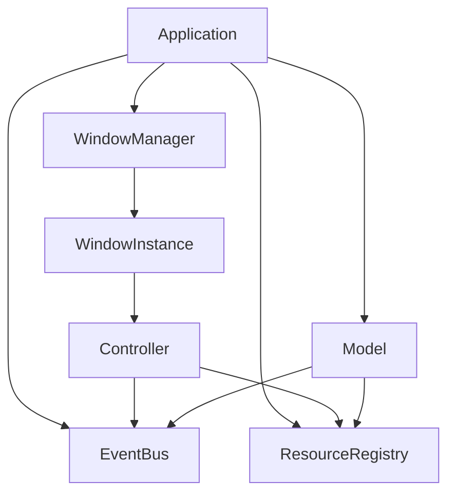
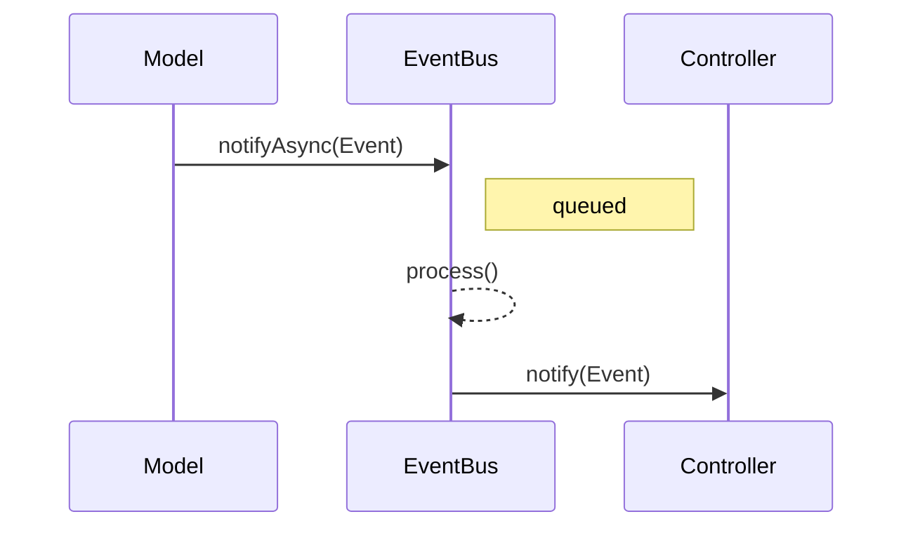
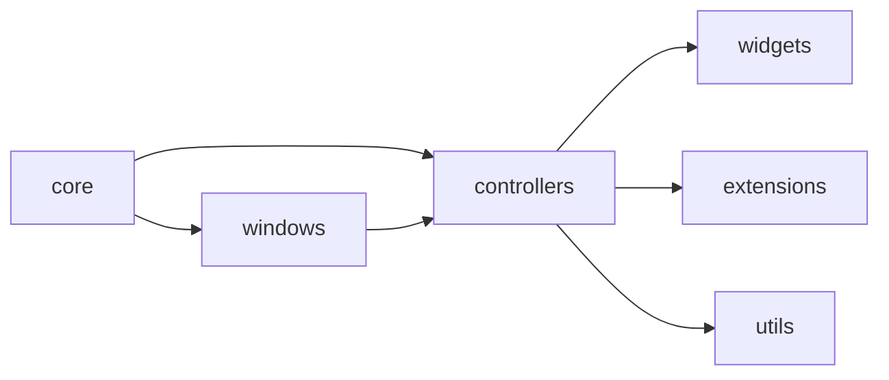

# Архитектура

ImGuiX сочетает подход **Immediate Mode GUI** из Dear ImGui с классическими
объектно‑ориентированными паттернами. Фреймворк организует приложение UI в
чётко определённые компоненты и каналы взаимодействия, благодаря чему большие
проекты остаются поддерживаемыми.

## Основные компоненты
- **Application** — владеет глобальными сервисами и главным циклом.
- **WindowManager** — создаёт и отслеживает окна.
- **WindowInstance** — представляет отдельное окно и его контекст рендеринга.
- **Controller** — объединяет покадровую логику и отрисовку.
- **Model** — пользовательские данные или бэкенды вроде `OptionsStore`.
- **EventBus** — асинхронный узел Publisher–Subscriber для развязанного обмена.
- **ResourceRegistry** — потокобезопасный доступ к общим ресурсам (шрифты,
  темы, виджеты и т.п.).

## Архитектурные паттерны
- **Immediate‑Mode MVC**: `WindowInstance` выступает в роли View, подклассы
  `Controller` совмещают логику и отображение, а модели хранят постоянное
  состояние.
- **Событийное взаимодействие**: компоненты отправляют события в `EventBus`;
  слушатели получают уведомления во время `EventBus::process()`.
- **Жизненный цикл / Template Method**: окна и контроллеры предоставляют хуки
  `onInit`, `drawContent` и `drawUi`, вызываемые циклом приложения в фиксированном
  порядке.
- **Фабрики**: контроллеры и модели создаются через фабричные функции.
  `WindowInstance::createController<T>()` возвращает ограниченный
  `WindowInterface&`, сохраняя инварианты.
- **Стратегии и расширяемость**: темы, шрифты и виджеты регистрируются динамически.
  `StrategicController` выбирает стратегии, а `ExtendedController` агрегирует
  дочерние элементы.
- **Посредник**: `EventMediator` упрощает управление подписками для всех
  контроллеров и моделей.
- **Реестр ресурсов**: почти синглтон‑реестр; повторная регистрация одного типа
  вызывает ошибку.
- **Контракт событий**: каждое событие наследует `Pubsub::Event` и реализует
  методы `type()` и `name()`.
- **Ограничения моделей**: прямые синхронные вызовы `notify` удалены; вне
  `process()` используйте `notifyAsync`. Внутри `process()` доступен переданный
  `SyncNotifier`.

## Обзор системы

## Поток событий

## Структура модулей

## Этапы жизненного цикла
1. `Application` инициализирует сервисы и `WindowManager`.
2. `WindowManager` создаёт объекты `WindowInstance`.
3. `WindowInstance::onInit()` строит контроллеры через `createController<T>()`.
4. Каждый кадр:
   - события ввода ставятся в очередь `EventBus`;
   - `EventBus::process()` доставляет сообщения;
   - `WindowInstance` вызывает хуки контроллеров (`drawContent`, `drawUi`).
5. Завершение работы выполняет хуки в обратном порядке.

Такая структура сохраняет модульность кода и простоту Immediate Mode‑рендеринга.
