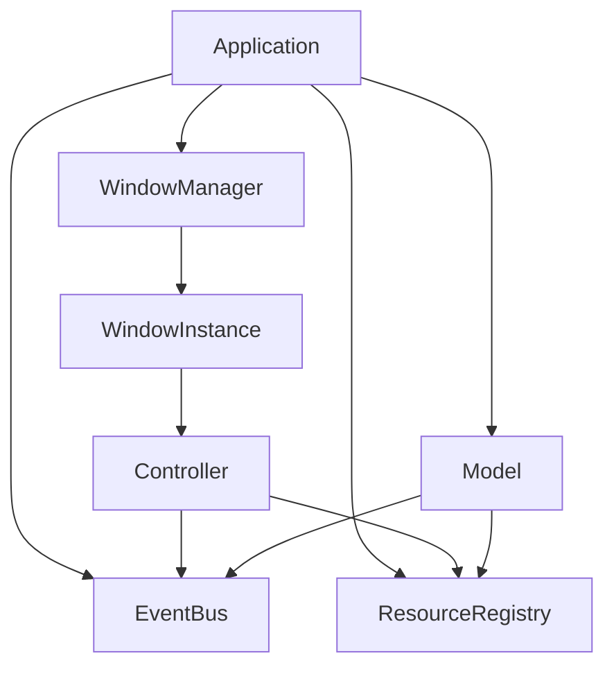
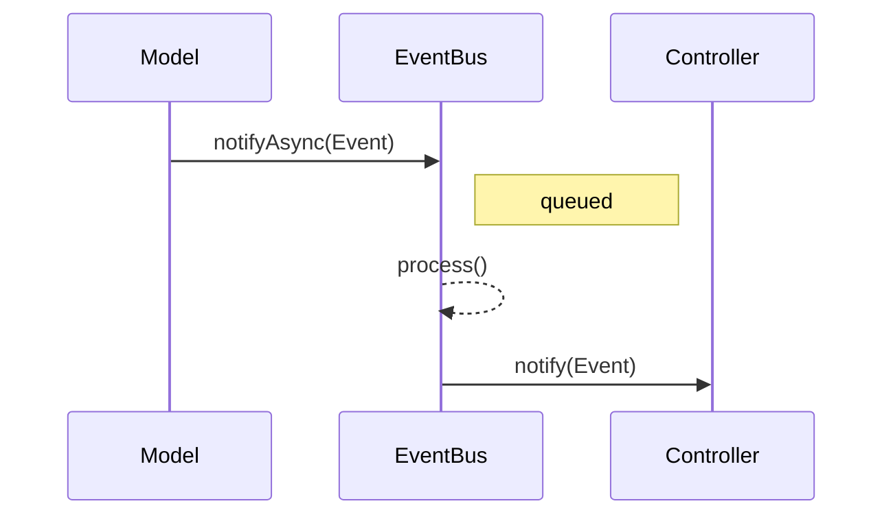
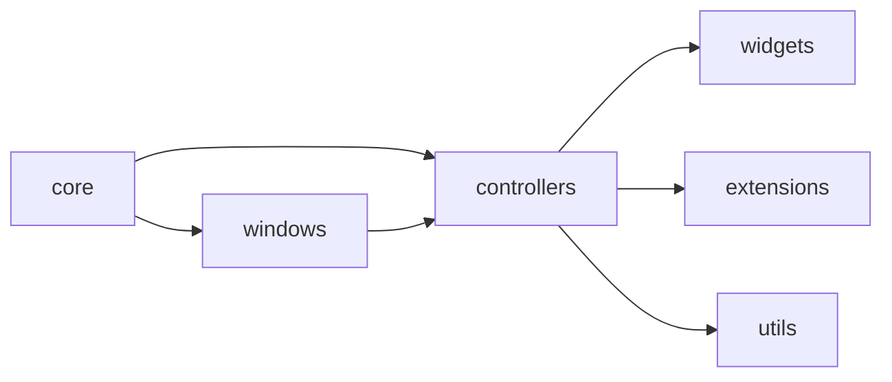

# Architecture

ImGuiX blends the **Immediate Mode GUI** approach of Dear ImGui with classic
object-oriented patterns. The framework organizes a UI application into
well-defined components and communication channels so large projects remain
maintainable.

## Core Components
- **Application** – owns global services and the main loop.
- **WindowManager** – creates and tracks windows.
- **WindowInstance** – represents a single window and its rendering context.
- **Controller** – combines per-frame logic and view rendering.
- **Model** – user data or backends such as `OptionsStore`.
- **EventBus** – asynchronous Publisher–Subscriber hub for decoupled messaging.
- **ResourceRegistry** – thread-safe access to shared resources (fonts, themes,
  widgets, etc.).

## Architectural Patterns
- **Immediate-Mode MVC**: `WindowInstance` acts as the View, `Controller`
  subclasses merge controller and view logic, and models hold persistent state.
- **Event-driven communication**: components post events to `EventBus`; listeners
  are notified during `EventBus::process()`.
- **Lifecycle / Template Method**: windows and controllers expose hooks such as
  `onInit`, `drawContent`, and `drawUi` which the application loop invokes in a
  fixed order.
- **Factories**: controllers and models are created via factory helpers.
  `WindowInstance::createController<T>()` returns a restricted
  `WindowInterface&` to preserve invariants.
- **Strategies & Extensibility**: themes, fonts, and widgets register dynamically.
  `StrategicController` selects strategies while `ExtendedController` aggregates
  children.
- **Mediator**: `EventMediator` simplifies subscription management for all
  controllers and models.
- **Resource Registry**: singleton-like registry; multiple registrations of the
  same type raise errors.
- **Event Contract**: every event derives from `Pubsub::Event` and implements
  `type()` and `name()`.
- **Model Restrictions**: direct synchronous `notify` calls are deleted; use
  `notifyAsync` outside `process()`. Inside `process()` models can use the
  provided `SyncNotifier`.

## System Overview

## Event Flow

## Module Layout

## Lifecycle Outline
1. `Application` initializes services and the `WindowManager`.
2. `WindowManager` creates `WindowInstance` objects.
3. `WindowInstance::onInit()` builds controllers via `createController<T>()`.
4. Each frame:
   - Input events are queued into `EventBus`.
   - `EventBus::process()` dispatches messages.
   - `WindowInstance` invokes controller hooks (`drawContent`, `drawUi`).
5. Shutdown hooks run in reverse order.

This structure keeps the code modular while preserving the simplicity of
Immediate Mode rendering.
